# Лабораторные работы по дисциплине  **"Теория языков и компиляторов"**
---
**Студент:** Бабаева Дарья
**Группа:** АП-326
**Год выполнения:** 2026
---
-[Лабораторная работа 1. Разработка пользовательского интерфейса (GUI) для языкового процессора](#лабораторная-работа-1)

-[Лабораторная работа 2. Разработка лексического анализатора (сканера)](#лабораторная-работа-2)

-[Лабораторная работа 3. Разработка синтаксического анализатора (парсера)](#лабораторная-работа-3)

-[Лабораторная работа 4. Реализация алгоритма поиска подстрок с помощью регулярных выражений](#лабораторная-работа-4)

-[Лабораторная работа 5. Построение AST и проверка контекстно-зависимых условий](#лабораторная-работа-5)

-[Лабораторная работа 7. Анализ и преобразование кода с использованием Clang и LLVM](#лабораторная-работа-7)

## Лабораторная работа 1. 
### Разработка пользовательского интерфейса (GUI) для языкового процессора

## Цель работы.
Создание кроссплатформенного графического интерфейса (GUI) для языкового процессора в виде специализированного текстового редактора.

## Сведения об авторе

ФИО: Бабаева Дарья  
Группа: АП-326  
Дисциплина: Теория формальных языков и компиляторов
Год выполнения: 2026 

## Описание проекта

Разработанное приложение представляет собой текстовый редактор с функцией анализа текста (упрощённый компилятор).

Программа позволяет:

- создавать и открывать текстовые файлы;
- сохранять документы;
- редактировать текст;
- выполнять синтаксический анализ;
- выявлять ошибки;
- отображать результаты анализа;
- переходить к месту ошибки по двойному щелчку.

Реализована подсветка синтаксиса (ключевые слова, строки, числа, комментарии).

## Используемые технологии
- Язык программирования: **C#**
- Платформа: **.NET**
- GUI-фреймворк: **Windows Forms (WinForms)**
- Среда разработки: **Microsoft Visual Studio**
- Система контроля версий: **Git**
- Хостинг репозитория: **GitHub**

## 5. Инструкция по сборке и запуску

Программа может работать как самостоятельное приложение и не требует установки Visual Studio.

---

## Запуск программы

1. Перейдите в папку с программой.
2. Найдите файл:

RGRCompilator.exe

3. Дважды щёлкните по файлу мышью.

Программа откроется как обычное приложение Windows.

---

## Если программа скачана из GitHub

1. Скачайте архив проекта (кнопка **Code → Download ZIP**).
2. Распакуйте архив в любую папку.
3. Найдите файл: RGRCompilator.exe
4. Дважды щёлкните по файлу мышью.

Программа откроется как обычное приложение Windows.

## Возможные проблемы

Если Windows показывает предупреждение безопасности:

1. Нажмите **Подробнее**.
2. Затем нажмите **Выполнить в любом случае**.

Это стандартное предупреждение для приложений без цифровой подписи.

---

## Системные требования

- Операционная система: Windows 10 / Windows 11
- Архитектура: 64-bit
- Дополнительные компоненты: не требуются
# 6. Руководство пользователя

---

## 6.1 Общий вид интерфейса

Программа состоит из:

1. Область редактирования (верхняя часть окна)
2. Область результатов анализа (нижняя часть окна)
3. Главное меню
4. Панель инструментов

## 6.2 Меню "Файл"

### Создать
Меню: **Файл → Создать**  
Кнопка: значок нового документа  

Создает новый файл.  
Если текст был изменен — появляется окно сохранения.

---

### Открыть
Меню: **Файл → Открыть**  
Кнопка: значок папки  

Открывает текстовый файл.

---

### Сохранить
Меню: **Файл → Сохранить**  
Кнопка: значок дискеты  

Сохраняет текущий файл.

---

### Сохранить как
Меню: **Файл → Сохранить как**  

Позволяет сохранить документ под новым именем.

---
### Выход
Меню: **Файл → Выход**

Закрывает программу с проверкой сохранения изменений.

---

## 6.3 Меню "Правка"

### Отменить
Меню: **Правка → Отменить**  
Кнопка: стрелка назад  

---

### Повторить
Меню: **Правка → Повторить**  
Кнопка: стрелка вперед  

---

### Копировать / Вставить
Меню: **Правка**

Работа с буфером обмена.

---

### Удалить
Удаляет выделенный текст.

---

### Выделить всё
Выделяет весь текст.

---

## 6.4 Запуск анализа

Для запуска анализа:

- Нажать кнопку **Пуск**
или
- Выбрать соответствующий пункт меню

---

## 6.5 Отображение ошибок

Программа обнаруживает:

- незакрытые строки;
- несоответствие скобок;
- недопустимые символы.

Ошибки отображаются в таблице результатов.

---

## 6.6 Переход к месту ошибки

Для перехода к ошибке:

1. Выполнить двойной щелчок по строке ошибки.
2. Курсор переместится к месту ошибки.
3. Ошибочный фрагмент будет выделен.

---

# 7. Ограничения

- Анализатор реализует базовые проверки.
- Подсветка синтаксиса упрощенная.
- Поддерживаются тексты небольшого объема.
- Проект разработан в учебных целях.

---
# Лабораторная работа 2.
## Разработка лексического анализатора (сканера)
 
## Цель работы.
Изучить назначение и принципы работы лексического анализатора в структуре компилятора. Спроектировать алгоритм (диаграмму состояний) и выполнить программную реализацию сканера для выделения лексем из входного текста. Интегрировать разработанный модуль в ранее созданный графический интерфейс языкового процессора.

## Постановка задачи

Необходимо разработать лексический анализатор (сканер) для обработки объявлений и определений структуры на языке C и интегрировать его в созданное приложение. Анализатор должен принимать на вход исходный текст программы, выделять лексемы, относящиеся к объявлению структуры (ключевые слова, идентификаторы, типы данных, числа, операторы и разделители), и классифицировать их по типам. Символы, не соответствующие допустимым лексемам, должны определяться как ошибки с указанием их позиции в тексте. Сканер должен корректно обрабатывать многострочный текст. Результаты лексического анализа необходимо выводить в таблицу DataGridView с указанием условного кода лексемы, её типа, значения и местоположения в тексте, а при выборе строки с ошибкой курсор в редакторе должен автоматически переходить к позиции недопустимого символа.

## Текстовое описание варианта
- Номер варианта: 9
- Объявление и определение структуры на языке C
В данном варианте рассматривается объявление и определение структуры на языке C. Структура используется для объединения нескольких переменных различных типов данных в одну логическую единицу. Объявление структуры начинается с ключевого слова struct, после которого указывается имя структуры и список её полей, заключённых в фигурные скобки. Поля структуры представляют собой переменные различных типов данных (например, int, char, float, double), каждое из которых заканчивается точкой с запятой. После определения структуры также может следовать объявление переменной данной структуры.

Лексический анализатор должен распознавать лексемы, используемые при объявлении структуры: ключевые слова языка C, идентификаторы, числовые значения, операторы и разделители. Любые символы, не входящие в допустимый набор, должны определяться как ошибки с указанием их позиции в тексте программы.

## Диаграмма состояний
Диаграмма состояний описывает работу конечного автомата, реализующего лексический анализатор для обработки объявлений структур на языке C. Начальным является состояние Start, из которого выполняется анализ первого символа входной строки. Если символ является буквой, автомат переходит в состояние 1, где происходит распознавание ключевых слов (struct, int, float, char, double, long) или идентификаторов. В зависимости от распознанного слова присваивается соответствующий условный код лексемы. Если встречается пробел, автомат переходит в состояние 2, где формируется лексема-разделитель. При обнаружении символа ; осуществляется переход в состояние 3, которое соответствует концу оператора. Символ { переводит автомат в состояние 4, а символ } — в состояние 5, где формируются соответствующие лексемы-разделители. Если входной символ не соответствует ни одному допустимому переходу, автомат переходит в состояние Error, что означает обнаружение недопустимого символа.

---

## Тестовые примеры

Пример 1. Вход: корректкая строка, введенная пользователем в область редактирования.

Выход: таблица, содержащая последовательность условных кодов и описаний лексем. struct Student { int id; char grade; float average; double scholarship; short course; };:

Пример 2. Вход: некорректная строка, введенная пользователем в область редактирования.

Выход: таблица, содержащая последовательность условных кодов и описаний лексем. struct Stud@ent { int id; };:

| Условный код | Тип лексемы   | Лексема	| Местоположение |
|--------------|---------------|------------|----------------|
|      14      |ключевое слово | struct		|строка 1, 1-6   |
|      11      |разделитель    | (пробел)	|строка 1, 7-7   |
|      2       |идентификатор  | Stud    	|строка 1, 8-11  |
|      99      |ошибка: Недопустимый символ   | @	|строка 1, 12-12 |
|      2       |идентификатор  | ent     	|строка 1, 13-15 |
|      11      |разделитель    | (пробел)	|строка 1, 16-16 |
|      11      |разделитель    | {      	|строка 1, 17-17 |
|      11      |разделитель    | (пробел)	|строка 1, 18-18 |
|      14      |ключевое слово | int		|строка 1, 19-21 |
|      11      |разделитель    | (пробел)	|строка 1, 22-22 |
|      2       |идентификатор  | id			|строка 1, 23-24 |
|      16      |конец оператора| ;			|строка 1, 25-25 |
|      11      |разделитель    | (пробел)	|строка 1, 26-26 |
|      11      |разделитель    | }          |строка 1, 27-27 |
|      16      |конец оператора| ;			|строка 1, 28-28 |
--------------------------------------------------------------

Пример 3. Вход: многострочный пример, введенный пользователем в область редактирования.

Выход: таблица, содержащая последовательность условных кодов и описаний лексем. struct 
struct Student
{
    int id;
    char grade;
    float average;
};:

| Условный код | Тип лексемы   | Лексема	| Местоположение |
|--------------|---------------|------------|----------------|
|      14      |ключевое слово | struct		|строка 1, 1-6   |
|      11      |разделитель    | (пробел)	|строка 1, 7-7   |
|      2       |идентификатор  | Student   	|строка 1, 8-14  |
|      11      |разделитель    | (перевод строки)	|строка 1, 15-1 |
|      11      |разделитель    | {      	|строка 2, 1-1   |
|      11      |разделитель    | (перевод строки)	|строка 2, 2-1 |
|      14      |ключевое слово | int		|строка 3, 5-7   |
|      11      |разделитель    | (пробел)	|строка 3, 8-8   |
|      2       |идентификатор  | id			|строка 3, 9-10  |
|      16      |конец оператора| ;			|строка 3, 11-11 |
|      11      |разделитель    | (перевод строки)	|строка 3, 12-1 |
|      14      |ключевое слово | char		|строка 4, 5-8   |
|      11      |разделитель    | (пробел)	|строка 4, 9-9   |
|      2       |идентификатор  | grade		|строка 4, 10-14 |
|      16      |конец оператора| ;			|строка 4, 15-15 |
|      11      |разделитель    | (перевод строки)	|строка 4, 16-1 |
|      2       |ключевое слово | float  	|строка 5, 5-9   |
|      11      |разделитель    | (пробел)	|строка 5, 10-10 |
|      2       |идентификатор  | average    |строка 5, 11-17 |
|      16      |конец оператора| ;			|строка 5, 18-18 |
|      11      |разделитель    | (перевод строки)	|строка 5, 19-1 |
|      11      |разделитель    | }          |строка 6, 1-1   |
|      16      |конец оператора| ;			|строка 6, 2-2   |
--------------------------------------------------------------

---
## Вывод
В ходе выполнения работы был разработан лексический анализатор для обработки объявлений и определений структуры на языке C. Реализован конечный автомат, позволяющий выделять и классифицировать лексемы исходного текста программы, такие как ключевые слова, идентификаторы, числа, операторы и разделители. Анализатор интегрирован в графический интерфейс приложения и выводит результаты анализа в виде таблицы с указанием типа лексемы, её условного кода и местоположения в тексте. Также реализовано обнаружение недопустимых символов и переход курсора к позиции ошибки. Проведённое тестирование показало корректную работу программы при обработке как корректных, так и ошибочных входных данных.

## Лабораторная работа 3. 
### Разработка синтаксического анализатора (парсера)

## Цель работы.
Изучить назначение и принципы работы синтаксического анализатора в структуре компилятора. Спроектировать грамматику, построить соответствующую схему метода анализа грамматики и выполнить программную реализацию парсера с нейтрализацией синтаксических ошибок методом Айронса. Интегрировать разработанный модуль в ранее созданный графический интерфейс языкового процессора.

## Постановка задачи
Разработать синтаксический анализатор (парсер) для конструкции объявления и определения структуры на языке C, интегрировать его в приложение из лабораторной работы №1 и обеспечить наглядный вывод результатов анализа.

## Текстовое описание варианта
- Номер варианта: 9
- Объявление и определение структуры на языке C
В данном варианте рассматривается объявление и определение структуры на языке C. Структура используется для объединения нескольких переменных различных типов данных в одну логическую единицу. Объявление структуры начинается с ключевого слова struct, после которого указывается имя структуры и список её полей, заключённых в фигурные скобки. Поля структуры представляют собой переменные различных типов данных (например, int, char, float, double), каждое из которых заканчивается точкой с запятой. После определения структуры также может следовать объявление переменной данной структуры.
Пример верной строки:
struct str1 {
    int i;
    char c;
    float f;
};

## Разработка грамматики

Для синтаксической конструкции объявления и определения структуры на языке C разработана контекстно-свободная грамматика. Грамматика описывает структуру вида struct <имя> { <список полей> };, где каждое поле задаётся типом и именем с последующей точкой с запятой.

Правила грамматики имеют следующий вид:

Разработанная грамматика используется для построения синтаксического анализатора методом рекурсивного спуска, при котором каждому нетерминальному символу соответствует отдельная процедура разбора.

## Классификация грамматики (по Хомскому)

Разработанная грамматика относится к классу контекстно-свободных грамматик (тип 2 по классификации Хомского), так как каждое правило имеет вид, в котором слева стоит один нетерминальный символ, а справа — последовательность терминальных и нетерминальных символов.
Грамматика не является автоматной, поскольку описывает вложенные и иерархические конструкции (структуру с блоком полей в фигурных скобках), что требует более мощного формализма.
Таким образом, для её обработки используется синтаксический анализ методом рекурсивного спуска, который подходит для контекстно-свободных грамматик.

## Метод анализа (алгоритм синтаксического анализа - рекурсивный спуск)

Для синтаксического анализа используется метод рекурсивного спуска. Данный метод основан на разборе входной последовательности лексем с помощью набора взаимосвязанных процедур, каждая из которых соответствует одному нетерминальному символу грамматики.
Анализ начинается с начального символа <StructDef> и выполняется последовательно, проверяя соответствие входной строки правилам грамматики. Для каждого нетерминала реализован отдельный метод (например, ParseStructDef, ParseFieldList, ParseField), который проверяет ожидаемые лексемы и вызывает другие методы при необходимости.
В случае несоответствия ожидаемой и фактической лексемы фиксируется синтаксическая ошибка, после чего анализ продолжается. Такой подход позволяет обнаруживать несколько ошибок за один проход.
Метод рекурсивного спуска выбран из-за его простоты реализации и наглядного соответствия разработанной грамматике.

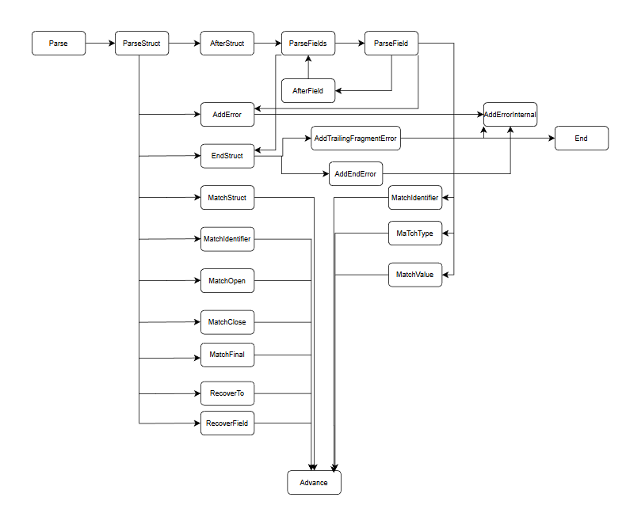

## Диагностика и нейтрализация синтаксических ошибок

В процессе синтаксического анализа выполняется диагностика ошибок, возникающих при несоответствии входной последовательности лексем правилам грамматики. При обнаружении ошибки фиксируется неверный фрагмент, его местоположение (номер строки и позиция) и описание.
Для обеспечения продолжения анализа используется метод нейтрализации ошибок Айронса. Суть метода заключается в пропуске части входной последовательности до ближайшего синхронизирующего символа (например, ;, {, }), после чего анализ продолжается с корректного состояния.
Данный подход позволяет не завершать работу после первой ошибки, а выявлять несколько синтаксических ошибок за один проход, что повышает информативность результатов анализа.

## Тестовые примеры

Для проверки работы синтаксического анализатора были использованы различные входные строки, включая корректные и содержащие ошибки. Результаты анализа отображаются в интерфейсе программы в виде таблицы ошибок.

Пример 1 — корректная строка
Входная строка:

struct str1 { 
 int i; 
 char c; 
 float f;
 };
 

Пример 2 — одна ошибка
Входная строка:  str1 {
    int i;
    char c;
    float f;
};

Пример 3 — несколько ошибок
Входная строка: str1 
    int i;
    char c;
    float f;
}

Пример 4 — отсутствие ключевого слова
Входная строка: str1 { int a; };

## Вывод

В ходе лабораторной работы был разработан синтаксический анализатор для конструкции объявления и определения структуры на языке C. Построена грамматика и реализован алгоритм синтаксического анализа методом рекурсивного спуска. В программе обеспечено выявление и обработка синтаксических ошибок с использованием метода Айронса, что позволяет продолжать анализ после обнаружения ошибок. Реализован удобный вывод результатов в виде таблицы с указанием местоположения ошибок и возможностью перехода к ним в тексте. Разработанный анализатор корректно обрабатывает как правильные, так и ошибочные входные данные.

## Лабораторная работа 4.
### Реализация алгоритма поиска подстрок с помощью регулярных выражений.

## Цель работы
Изучить теоретические основы регулярных выражений и их применение для поиска и извлечения подстрок из текста. Освоить практические навыки использования библиотечных средств работы с регулярными выражениями, а также интеграцию алгоритмов поиска в графический интерфейс приложения.

## Постановка задачи
Разработать модуль поиска подстрок с использованием регулярных выражений, интегрировать его в существующее приложение (текстовый редактор) и обеспечить наглядный вывод результатов.
Вариант задания:
Блок 1: 12.Построить РВ для того, чтобы сопоставить все числа, которые не заканчиваются на 5.
Блок 2: 27. Построить РВ, описывающее все виды комментариев (язык Python).
Блок 3: 26. Построить РВ для поиска любого химического элемента из таблицы Менделеева (118 элементов).

## Решение задач

1. Построить РВ для того, чтобы сопоставить все числа, которые не заканчиваются на 5.
Описание задачи: Требуется найти все целые неотрицательные числа (последовательности цифр), у которых последняя цифра — любая, кроме 5. Числа не должны содержать лишних символов, должны быть отделены границами слова.
Регулярное выражение: \b\d*[0-46-9]\b

- \b - граница слова (начало числа)
- \d* - ноль или более цифр
- [0-46-9] - ровно одна цифра, кроме 5 (0–4 или 6–9)
- \b - граница слова (конец числа)

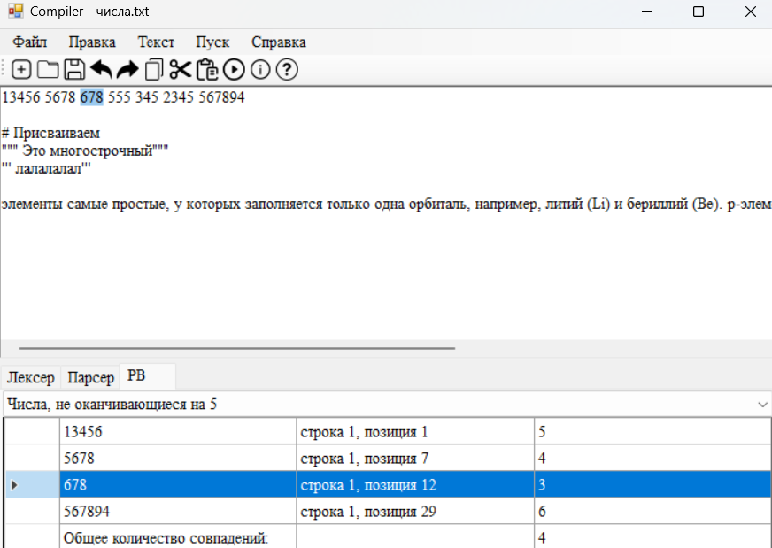

2. Построить РВ, описывающее все виды комментариев (язык Python).
Описание задачи: Находит однострочные (# ...) и многострочные (""" ... """ или ''' ... ''') комментарии в коде Python. Многострочные комментарии могут содержать любые символы, включая переносы строк.
Регулярное выражение: #.*$|"""[\s\S]*?"""|'''[\s\S]*?'''

Пояснение
- #.*$ - от # до конца строки
-"""[\s\S]*?""" -  текст между тройными двойными кавычками (ленивый захват)
- '''[\s\S]*?''' -текст между тройными одинарными кавычками (ленивый захват)
- [\s\S] - любой символ (включая перевод строки)
- *? - минимальное количество повторений

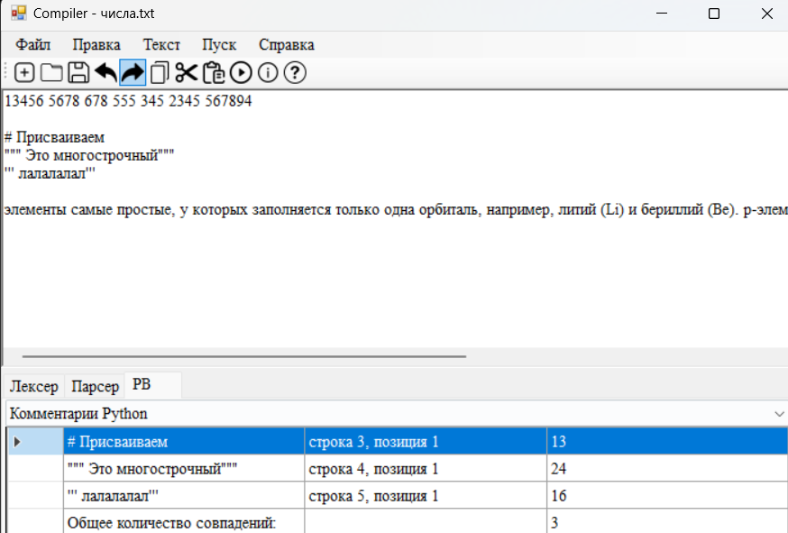

3. Построить РВ для поиска любого химического элемента из таблицы Менделеева (118 элементов).
Описание задачи: Находит названия всех 118 химических элементов из таблицы Менделеева.
Регулярное выражение: \b(H|He|Li|Be|B|C|N|O|F|Ne|Na|Mg|Al|Si|P|S|Cl|Ar|K|Ca|Sc|Ti|V|Cr|Mn|Fe|Co|Ni|Cu|Zn|Ga|Ge|As|Se|Br|Kr|Rb|Sr|Y|Zr|Nb|Mo|Tc|Ru|Rh|Pd|Ag|Cd|In|Sn|Sb|Te|I|Xe|Cs|Ba|La|Ce|Pr|Nd|Pm|Sm|Eu|Gd|Tb|Dy|Ho|Er|Tm|Yb|Lu|Hf|Ta|W|Re|Os|Ir|Pt|Au|Hg|Tl|Pb|Bi|Po|At|Rn|Fr|Ra|Ac|Th|Pa|U|Np|Pu|Am|Cm|Bk|Cf|Es|Fm|Md|No|Lr|Rf|Db|Sg|Bh|Hs|Mt|Ds|Rg|Cn|Nh|Fl|Mc|Lv|Ts|Og)\b

Пояснение
- \b - граница слова (начало)
-(H|He|Li|...) - перебор всех 118 символьных обозначений (первая буква заглавная, вторая строчная, если есть)
- \b - граница слова (конец)

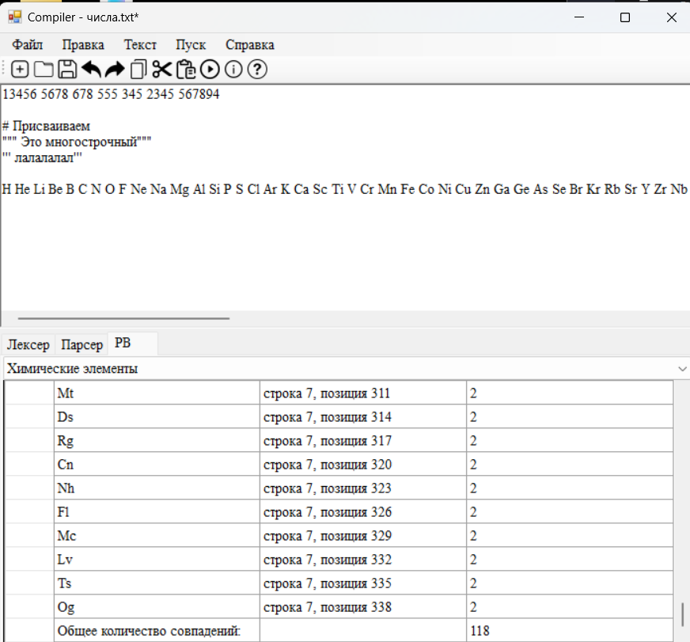

### Граф автомата
Описание: Для задачи из 2 блока (Комментарии Python) необходимо реализовать алгоритм поиска подстрок в тексте, перейдя к графу автомата. 

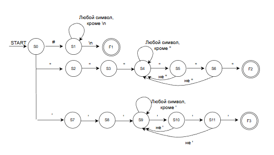

## Лабораторная работа 5.
### Построение AST и проверка контекстно-зависимых условий.

## Цель работы
Изучить назначение и принципы работы семантического анализатора в структуре компилятора. Освоить методы построения абстрактного синтаксического дерева (AST) и проверки контекстно-зависимых условий (семантических правил) для заданной синтаксической конструкции.

## Вариант задания
Тема работы: разработка семантического анализатора для конструкций объявления структуры на языке С. 
Описание задачи: В рамках работы необходимо развить синтаксический анализатор до семантического и реализовать проверку контекстно-зависимых условий.
В качестве входных данных используется строка кода, содержащая объявление структуры на языке C.
Семантический анализатор должен:
строить абстрактное синтаксическое дерево (AST);
проверять корректность объявления структуры;
выявлять семантические ошибки;
выводить сообщения об ошибках с указанием позиции.

## Контекстно-зависимые условия
В качестве контекстно-зависимого условия была выбрана проверка уникальности идентификаторов.

Это связано с тем, что при объявлении структуры основная семантическая ошибка, которая действительно может возникнуть в рамках данной конструкции, — это повторное объявление имени поля. В языке C имена полей внутри одной структуры должны быть уникальными, и нарушение этого правила приводит к ошибке компиляции. Поэтому реализация проверки уникальности является необходимой и достаточной для корректной обработки рассматриваемого подмножества языка.

|Условие | Пример входной строки | Ожидаемое сообщение|
|--------|-----------------------|--------------------|
|Корректное объявление | struct str1 { int i; char c; float f; }; | Ошибок нет |
| Повторное объявление идентификатора | struct str1 { int i; char i; float f; }; | Ошибка: идентификатор "i" уже объявлен ранее |

Остальные контекстно-зависимые условия в данной работе не реализованы, поскольку они не применимы к рассматриваемой конструкции или требуют расширения грамматики.

Проверка совместимости типов предполагает наличие операций присваивания или выражений. Однако в стандартном объявлении структуры на языке C поля только объявляются, без инициализации значениями, поэтому данная проверка в рамках задачи не требуется.
Аналогично, проверка допустимых значений невозможна, так как значения в объявлении структуры отсутствуют. Следовательно, отсутствует и необходимость контроля диапазонов значений для числовых типов.
Проверка использования объявленных идентификаторов также не реализуется, поскольку в структуре не используются выражения, в которых могли бы встречаться необъявленные переменные.

Таким образом, остальные правила носят теоретический характер и могут быть реализованы при расширении языка, например, при добавлении инициализации или выражений.

## Структура AST

В программе используется абстрактное синтаксическое дерево AST, предназначенное для представления смысловой структуры входной конструкции без лишних служебных синтаксических элементов. В отличие от CST, в AST не сохраняются все скобки, точки с запятой и промежуточные нетерминалы грамматики, а остаются только узлы, имеющие смысл для дальнейшего семантического анализа.
Для рассматриваемой конструкции объявления структуры на языке C в программе используются следующие типы узлов AST.

SemanticAstNode — базовый абстрактный класс для всех узлов дерева. Он содержит список дочерних узлов и служит общей основой для представления AST.

StructDeclNode — узел объявления структуры. Хранит имя структуры и список дочерних узлов, соответствующих объявлениям полей. Этот узел является корнем дерева для конструкции вида struct имя { ... };.

FieldDeclNode — узел объявления поля структуры. Хранит тип поля и его имя. Каждый такой узел соответствует одному полю внутри структуры.

Таким образом, для входной строки с объявлением структуры корень дерева представлен узлом StructDeclNode, а его дочерними элементами являются узлы FieldDeclNode, описывающие отдельные поля.

Пример: struct str1 {
    int i;
    char c;
    float f;
};
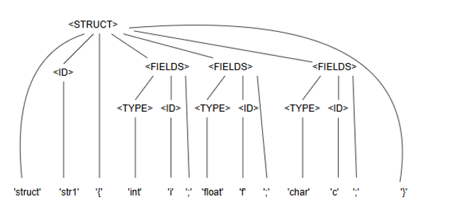

### Формат вывода AST в программе
В программе AST выводится в двух формах: в текстовом и в графическом виде.

Текстовый вывод представляет дерево в иерархическом формате с использованием отступов и специальных символов ├── и └──. Такой способ позволяет наглядно увидеть структуру дерева, связи между узлами и порядок их вложенности. Для каждого узла указывается его тип и основные атрибуты.

Пример: struct str1 {
    int i;
    char c;
    float f;
};
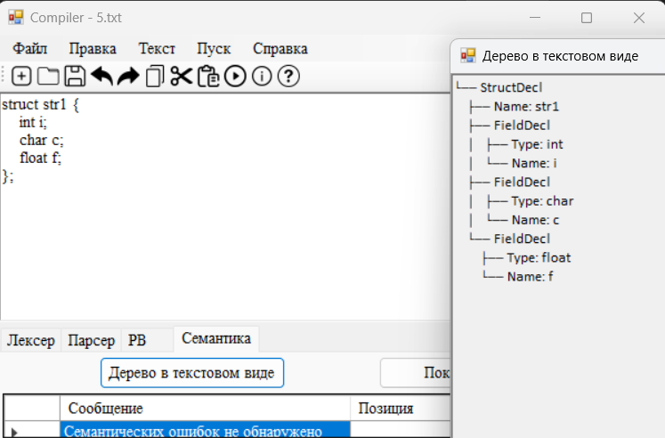

Графический вывод выполняется в отдельном окне по нажатию кнопки «Показать AST». Визуализация строится в виде дерева, где каждый узел отображается прямоугольным блоком с указанием типа узла и его ключевых атрибутов, а рёбра показывают отношения между родительскими и дочерними узлами.

Для рассматриваемой конструкции объявления структуры на языке C в дереве используются узлы StructDeclNode и FieldDeclNode. Узел StructDeclNode содержит имя структуры, а узлы FieldDeclNode содержат тип поля и его имя.

Пример: struct str1 {
    int i;
    char c;
    float f;
};
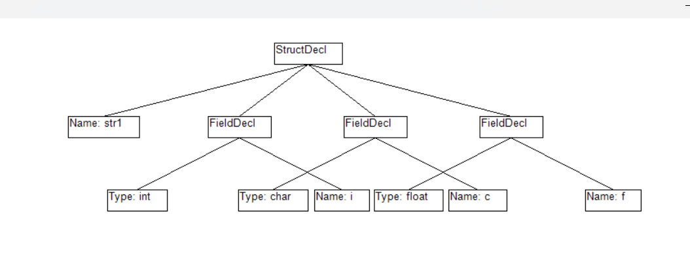

### Использование графических средств
Для визуализации абстрактного синтаксического дерева (AST) в программе использованы стандартные средства графического интерфейса библиотеки Windows Forms (WinForms).

Отображение дерева реализовано в отдельном окне (Form), которое открывается по нажатию кнопки «Показать AST».

Для построения графического представления были использованы следующие компоненты и средства:

-Form — отдельное окно для отображения AST;
-Panel — контейнер с поддержкой прокрутки (AutoScroll), позволяющий просматривать дерево при -больших размерах;
-PictureBox — область для рисования графического дерева;
-Graphics — объект для выполнения графических операций;
Методы рисования:
-DrawRectangle() — для отображения узлов дерева;
-DrawString() — для вывода текста (тип узла и атрибуты);
-DrawLine() — для отображения связей между узлами (рёбра дерева).

Построение дерева выполняется рекурсивно: каждый узел отображается в виде прямоугольника с текстом, а затем от него строятся линии к дочерним узлам.

## Тестовые примеры
1. Пример верной строки
struct str1 {
    int i;
    char c;
    float f;
};

2. Пример с семантической ошибкой (повтор идентификатора)
   struct str1 {
    int i;
    char i;
    float f;
};
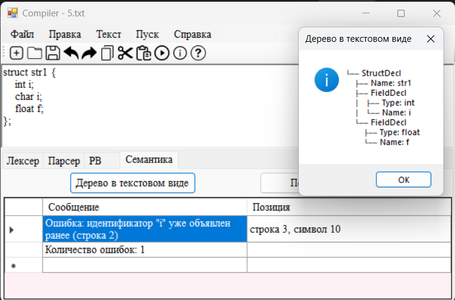
3. Пример с синтаксической ошибкой (отсутствует ;)
   struct str1 {
    int i;
    char i;
    float f;
}
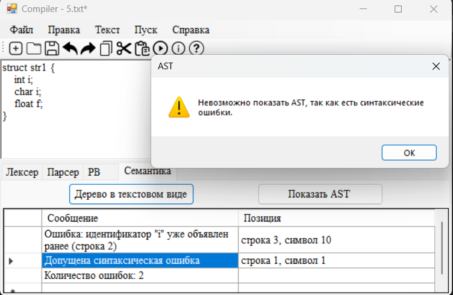

## Иструкция по запуску
Приложение является автономным и не требует установки сторонних библиотек, дополнительных программ или специальных компонентов. Для запуска достаточно открыть исполняемый файл программы.

После сборки проекта приложение запускается через файл с расширением .exe, который находится в папке сборки bin\Release.

Для запуска программы необходимо:

открыть папку с готовым приложением;
найти исполняемый файл проекта;
дважды щёлкнуть по файлу .exe.

После запуска откроется главное окно программы, в котором можно ввести исходный текст, выполнить анализ и просмотреть AST в текстовом или графическом виде.

## Лабораторная работа 7.
### Анализ и преобразование кода с использованием Clang и LLVM.

## Постановка задачи
Постановка общей задачи: Изучить процесс компиляции программ с использованием инструментов Clang и LLVM, получить абстрактное синтаксическое дерево (AST) и промежуточное представление LLVM IR, а также исследовать влияние оптимизаций на структуру и выполнение программы. Построить граф потока управления (CFG) и выполнить анализ полученных результатов.

Постановка индивидуальной задачи (Структуры/Записи): Исследовать представление структур в AST и LLVM IR, проанализировать особенности передачи структур в функции до и после оптимизации (-O2), построить CFG для функций программы и определить влияние встраивания функций на обработку структур.

## Описание хода работа 
### Общее задание
1.1 Установка и подготовка среды 
Работа выполнялась в среде Ubuntu 22.04. Установлены следующие инструменты:
- clang - компилятор языка C/C++.
- llvm - инструменты анализа и опттимизации кода;
- opt — инструмент для работы с LLVM IR и применения оптимизаций;
- Graphviz — инструмент для визуализации кода.
Команда установки: sudo apt install clang llvm

Далее был создан исходный файл программы на языке С, содержащий функцию работы со структурой и ее использование в функции main. Код сохранен в отдельный файл для последующий обработки.
Программа на языке C:
#include <stdio.h>
int square(int x) {
 return x * x;
}
int main() {
4
 int a = 5;
 int b = square(a);
 printf("%d\n", b);
 return 0;
}
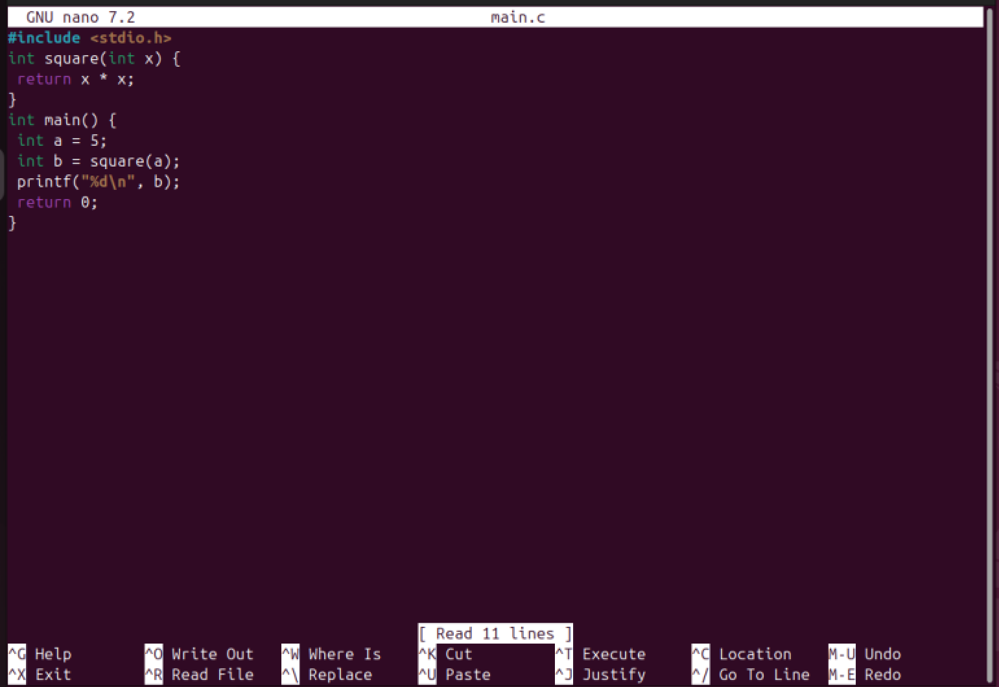

Получение AST. С помощью команды Clang было построено абстрактное синтаксическое дерево (AST). Это позволило увидеть структуру программы, объявления функций, переменных и порядок выполнения операций.
Команда: clang -Xclang -ast-dump -fsyntax-only main.c
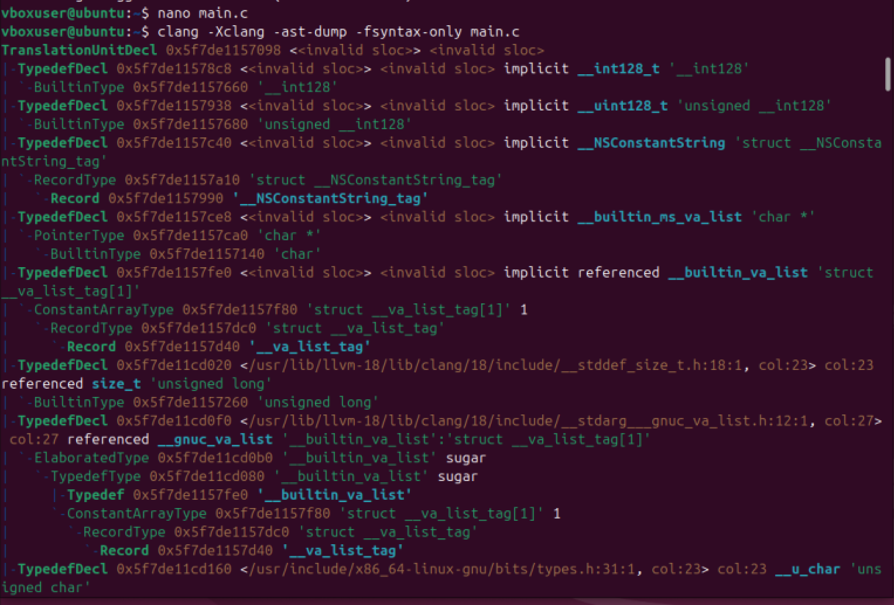
Функция square принята, содержит параметр x и возвращает x * x.

Генерация LLVM IR. Исходный код был преобразован в промежуточное представление LLVM IR. Данное представление используется компилятором для дальнейшего анализа и оптимизации программы.
Команда: clang -S -emit-llvm main.c -o main.ll
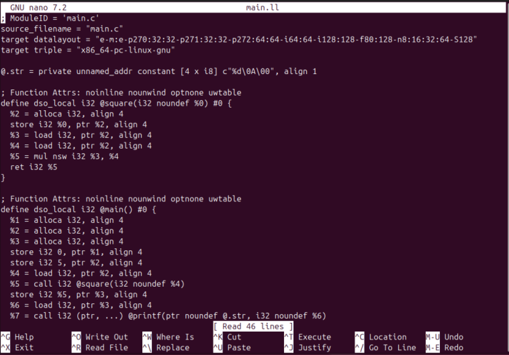

Оптимизация IR
Были получены версии IR без оптимизации (-O0) и с оптимизацией (-O2). Проведено сравнение результатов. Отмечено, что после оптимизации упрощается код, удаляются лишние операции и может происходить встраивание функций.
Команда: clang -O0 -S -emit-llvm main.c -o main_O0.ll
В файле с IR до оптимизации: все переменные (a, b, x.addr) размещены в памяти через alloca; множество операций load и store; square вызывается как отдельная функция.
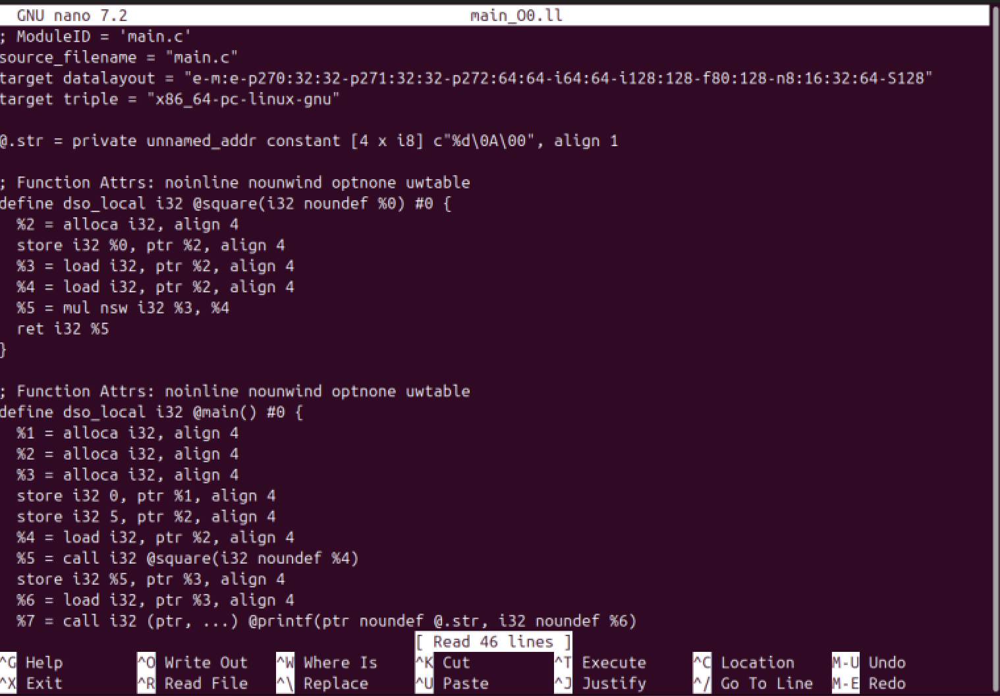
Команда: clang -O2 -S -emit-llvm main.c -o main_O2.ll
Команда -O2 – комплексная оптимизация среднего уровня. Она применяет более 30 различных оптимизаций:
-inline – встраивание небольших функций (встраивает square в main, если она вызывается один раз);
-constprop – подставит значение square(5) → 25, если функция встроена и всё известно на этапе компиляции;
-mem2reg – перевод переменных из памяти в регистры (SSA);
-instcombine – объединение и упрощение инструкций (упростит арифметику, например x * x может быть преобразовано в shl при x = 2^n);
-simplifycfg – оптимизирует структуру блоков (Упростит граф управления, если после inlining останутся лишние блоки);
-reassociate, -gvn, -sroa, -dce и другие.
В файле с IR после оптимизации:
Вся функция square исчезла – она была встроена (-inline) и затем вычислена (оптимизация -constprop);
Никаких переменных, alloca, store, load – всё удалено (оптимизации -mem2reg, -dce);
Остался только вызов printf(25)
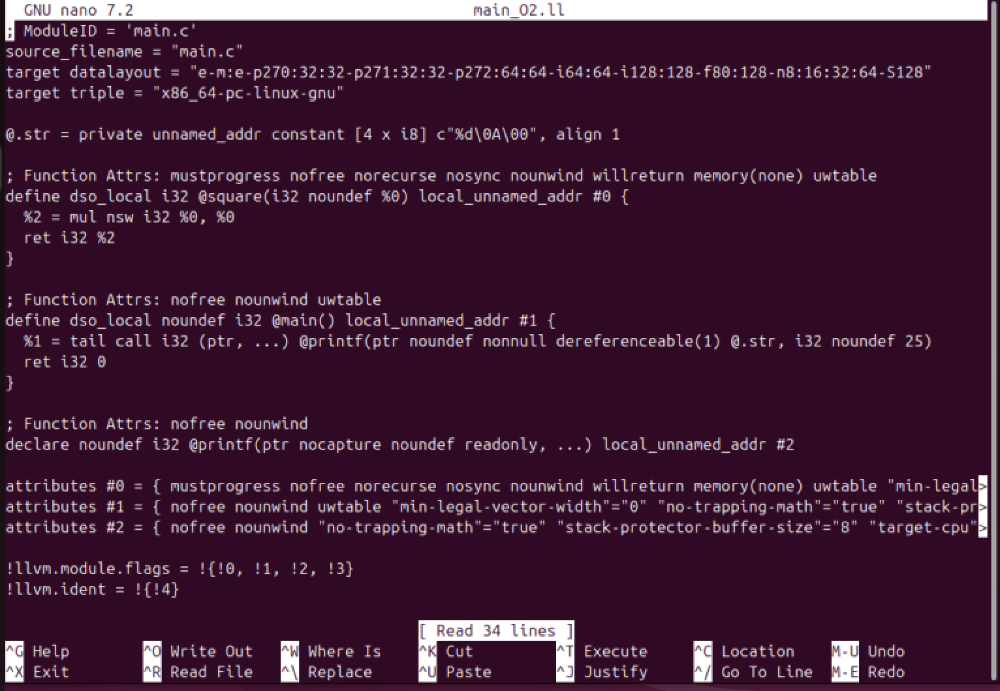
Команда: diff main_O0.ll main_O2.ll
Сравнение двух файлов:
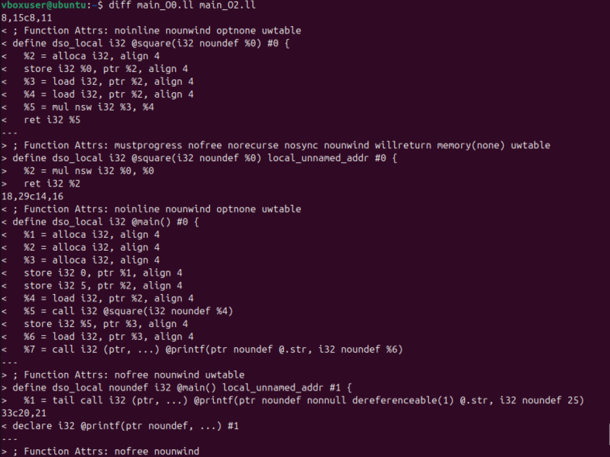
Стоит отметить, что после оптимизации произошли следующие
изменения:
-Переменные типа alloca были удалены;
-Код переведён в SSA-форму;
-Оптимизация улучшила читаемость и упростила поток управления.

Построение графа потока управления (CFG). С использованием инструмента opt был построен граф потока управления для функций программы. Графы были визуализированы с помощью Graphviz, что позволило наглядно проанализировать структуру выполнения программы.
Для построения графа потока управления (CFG) использовалась команда, отличающаяся от приведённой в методических указаниях. Вместо opt -dot-cfg -disable-output main.ll была применена команда:

opt -passes=dot-cfg -disable-output main_00.ll

Данная команда выполняет аналогичную задачу генерации .dot-файлов для функций программы, однако использует новый синтаксис указания проходов (-passes=...), применяемый в современных версиях LLVM. В результате были успешно сгенерированы файлы .main.dot и .square.dot, что подтверждается выводом программы.
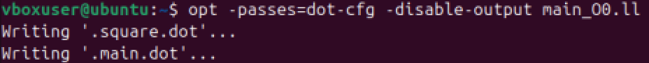
Эта команда создаст DOT-файлы: .main.dot – для функции main; .square.dot – для square, если она не была удалена оптимизацией. 
Команда для установки библиотеки Graphviz: sudo apt install graphviz
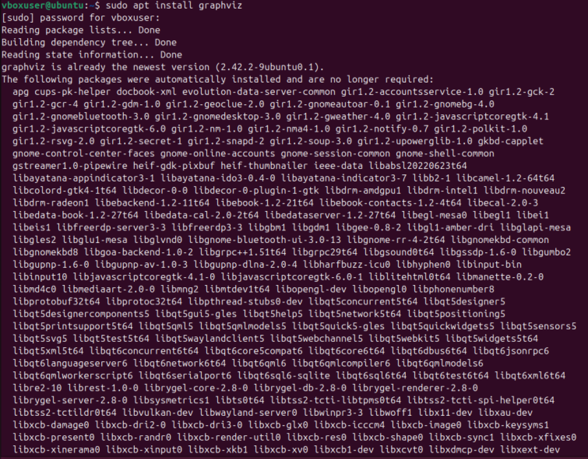
Команды для преобразования файлов с расширением .dot в .png с помощью Graphviz:
dot -Tpng .main.dot -o cfg_main.png
dot -Tpng .square.dot -o cfg_square.png
Команды для просмотра файлов с CGF:
xdg-open cfg_main.png
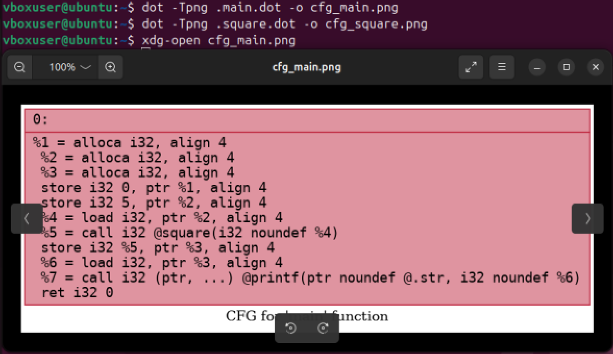
xdg-open cfg_square.png
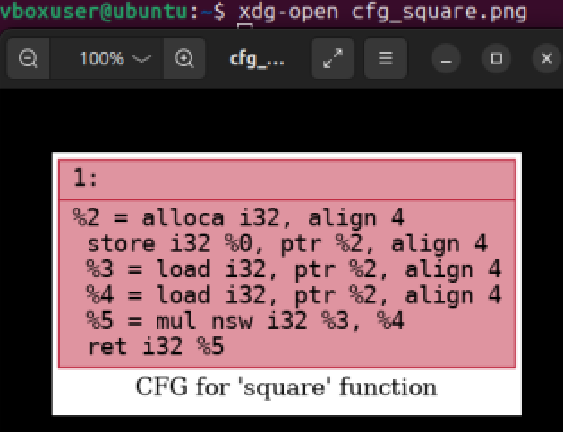
Стоит отметить, что в LLVM каждый граф потока управления (CFG) строится на уровне функции, поскольку структура управления всегда локальна для тела функции. Для получения полного представления о программе, нужно построить CFG для всех функций и анализировать их совокупность. Автоматическое объединение всех CFG в один граф не предусмотрено в LLVM по умолчанию.

Выводы:
В ходе работы были изучены инструменты Clang и LLVM, получены абстрактное синтаксическое дерево (AST) и промежуточное представление LLVM IR. Установлено, что оптимизации упрощают код, уменьшают количество операций и повышают эффективность выполнения программы.
Построение графа потока управления (CFG) позволило наглядно проанализировать структуру и логику выполнения программы.

### Индивидуальное задание
Была создана программа на языке С, содержащая структуру Point, функцию ее обработки (sum) и вызов этой функции в main.
Пример кода:
#include <stdio.h>
struct Point {
int x;
int y;
};
int sum(struct Point p) {
return p.x + p.y;
}
int main() {
struct Point p = {2, 3};
int result = sum(p);
printf("%d\n", result);
return 0;
}
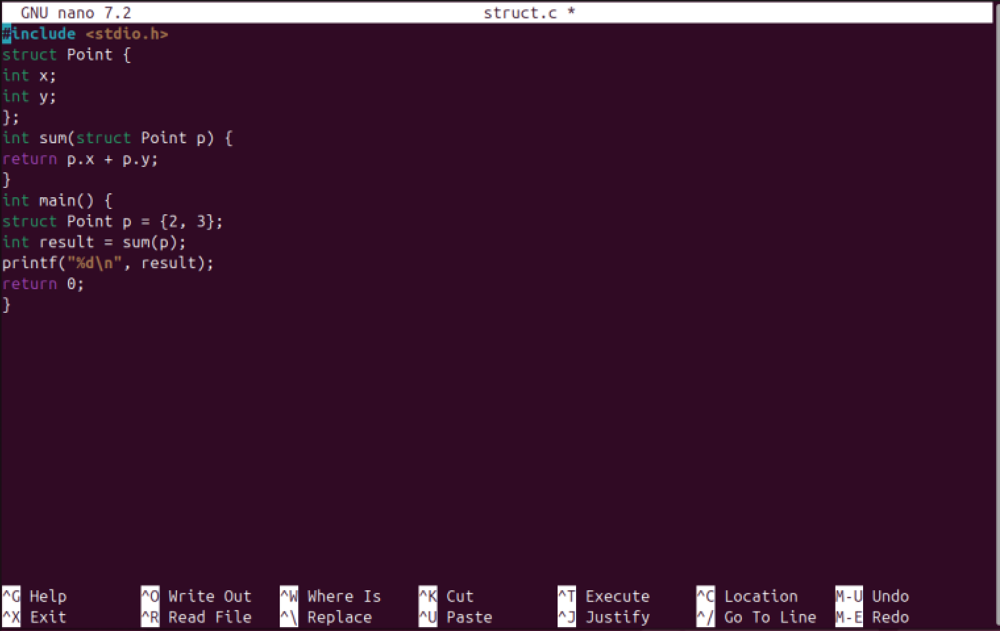

#### 1. Получение AST и LLVM IR
 Для исходной программы со структурой Point с помощью Clang были получены абстрактное синтаксическое дерево (AST) и промежуточное представление LLVM IR без оптимизаций. Это позволило проанализировать, как структура и её поля представлены на уровне компилятора.
Команда: clang -Xclang -ast-dump -fsyntax-only struct.c
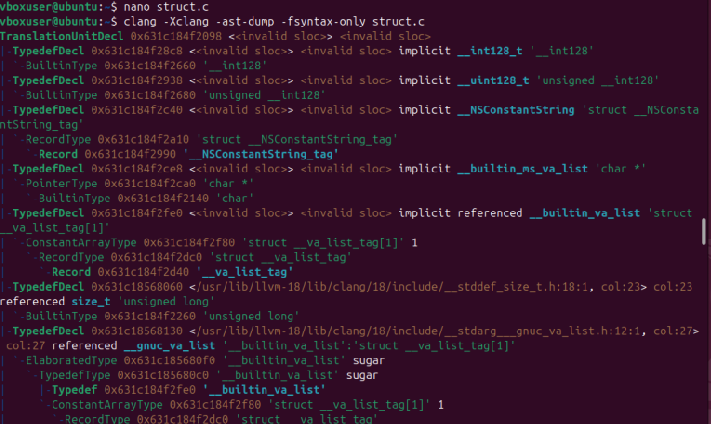
Генерация LLVM IR.
Команда: clang -S -emit-llvm struct.c -o struct.ll
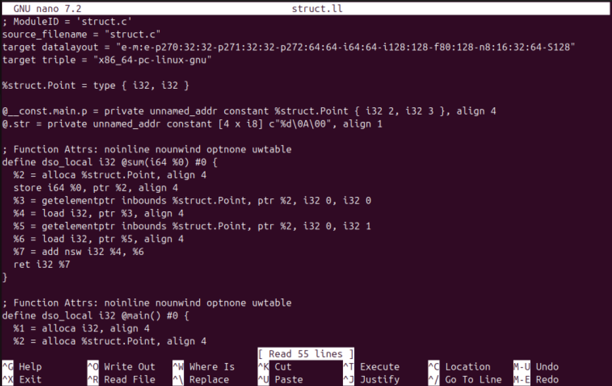
#### 2. Применение -О2
IR для -O0
Команда: clang -O0 -S -emit-llvm const.c -o struct_O0.ll
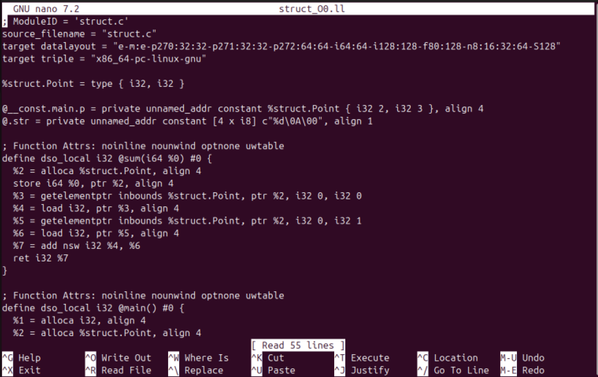
На рисунке показано промежуточное представление LLVM IR программы без оптимизаций (-O0). Структура Point объявлена как %struct.Point = type { i32, i32 }.
В функции sum структура передаётся как аргумент и размещается в памяти с помощью alloca. Для доступа к полям используются инструкции getelementptr, load и store, что указывает на работу через память.

IR для -O2
Команда: clang -O2 -S -emit-llvm const.c -o struct_O2.ll
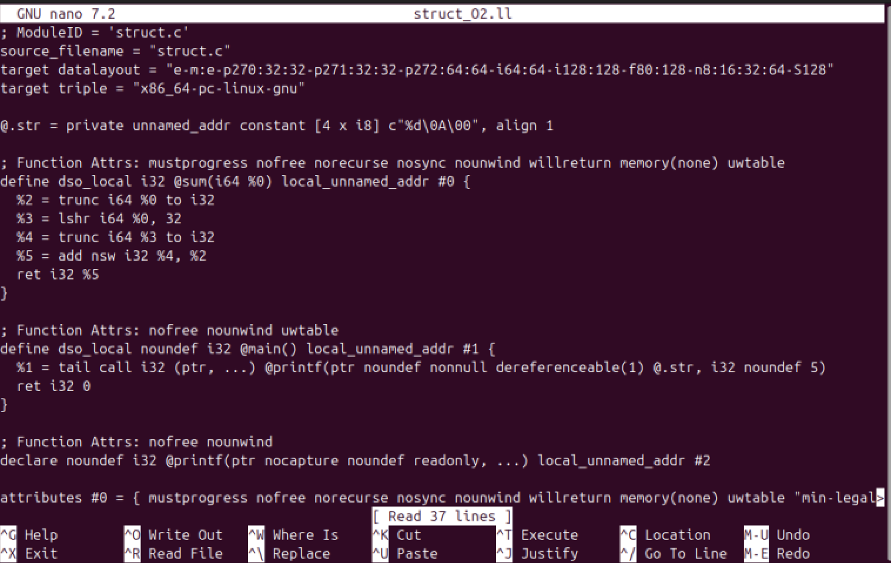
Показан LLVM IR после оптимизации (-O2): структура больше не хранится в памяти, а передаётся как одно значение i64, поля извлекаются через trunc и lshr.

Сравнение с -O0:
Команда: diff struct_O0.ll struct_O2.ll
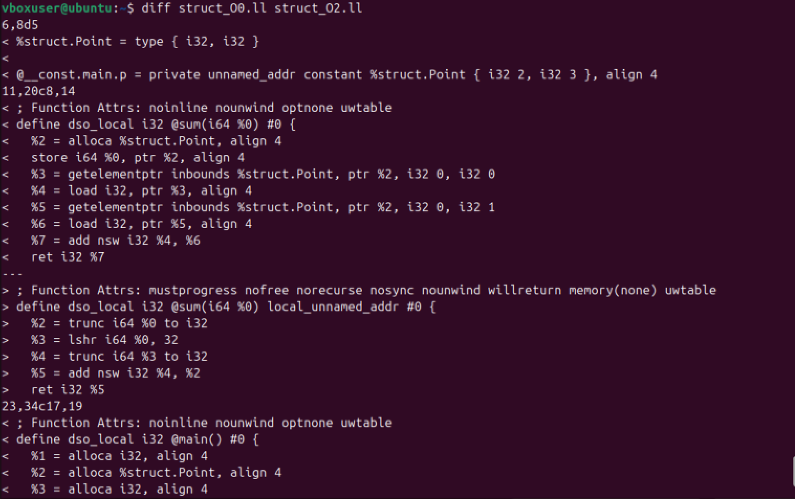
После применения оптимизации -O2 структура по-прежнему передаётся по значению.
Однако LLVM оптимизирует её представление: вместо работы через память структура упаковывается в одно значение (i64), а доступ к полям выполняется через регистровые операции.

#### 3. Построение CFG
Построение было выполнено с помощью команд: 
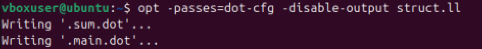
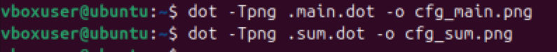
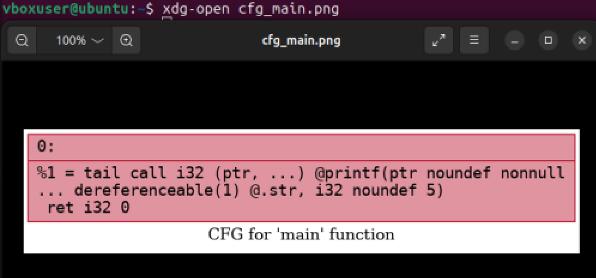
Граф потока управления функции main состоит из одного базового блока. В нём выполняется вызов функции printf и возврат значения. Отсутствие ветвлений показывает, что код был упрощён после оптимизации.
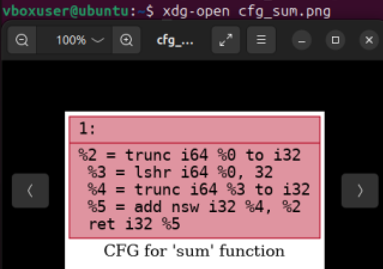
Граф потока управления функции sum также состоит из одного базового блока. Внутри выполняются операции извлечения полей структуры и их сложение. Управляющие конструкции отсутствуют, выполнение линейное.

#### 4. Добавление __attribute__((always_inline))
В файле nano struct.c меняем функцию sum на __attribute__((always_inline)) inline int sum(struct Point p) {
    return p.x + p.y;
} и сохраняем файл.
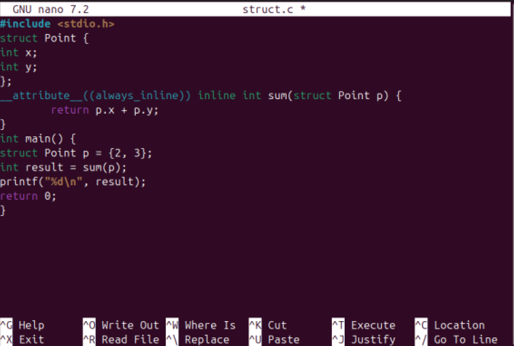
Генерируем LLVM IR:
clang -O2 -S -emit-llvm struct.c -o struct_inline.ll
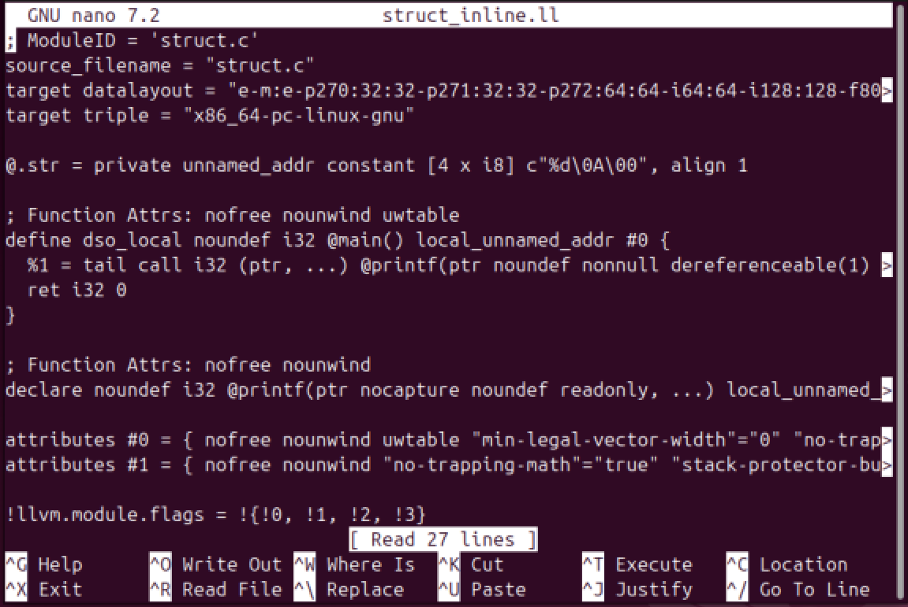
После добавления __attribute__((always_inline)) функция sum принудительно встраивается в main. В результате вызов функции исчезает, а операция сложения полей структуры выполняется непосредственно внутри main. Это уменьшает количество инструкций и убирает лишнюю передачу структуры в отдельную функцию.

#### 5. Вывод: как LLVM оптимизирует передачу структур?
LLVM оптимизирует передачу структур, устраняя лишние обращения к памяти и представляя структуру в виде одного значения (например, i64). Поля структуры извлекаются с помощью регистровых операций, таких как trunc и lshr.

При оптимизации также возможно встраивание функций, что позволяет избежать передачи структуры в отдельную функцию и упростить код.

### Ответы на контрольные вопросы
1. Что такое Clang, и какова его роль в процессе компиляции программ?
Clang — это фронтенд-компилятор для языков C/C++, который выполняет разбор исходного кода, строит AST и генерирует промежуточное представление LLVM IR.
2. Что представляет собой LLVM и как он используется всовременных компиляторах?
LLVM  — это модульная инфраструктура для разработки компиляторов, анализа кода и генерации оптимизированного машинного кода. Используется как backend в современных компиляторах.
3. Чем отличается абстрактное синтаксическое дерево (AST) от промежуточного представления LLVM IR?
AST отражает синтаксическую структуру исходного кода, а LLVM IR — низкоуровневое представление, близкое к ассемблеру, в SSA-форме; оно не зависит от языка и от целевой архитектуры.
4. Для чего необходимо промежуточное представление (IR) в процессе компиляции?
Промежуточное представление (IR) служит связующим звеном между исходным кодом и машинным кодом. Оно является независимым от конкретного языка программирования и архитектуры процессора, что позволяет применять одни и те же оптимизации для разных языков и платформ. IR упрощает анализ программы, так как имеет более строгую и унифицированную структуру по сравнению с исходным кодом.
5. Что делает инструкция alloc в LLVM IR, и зачем она используется в функциях?
Инструкция alloca выделяет память в стеке функции для локальных переменных. Она используется для хранения значений, особенно на этапе без оптимизаций. При оптимизации такие переменные часто переносятся из памяти в регистры.
6. Зачем нужна оптимизация кода в компиляторе, и какие основные цели она преследует?
Оптимизация нужна для повышения эффективности программы. Основные цели: уменьшение времени выполнения, снижение потребления памяти, сокращение количества инструкций и упрощение структуры кода.
7. Что такое SSA-форма и почему она важна при оптимизации программ?
SSA (Static Single Assignment) — форма, при которой каждая переменная присваивается только один раз. Это упрощает анализ зависимостей между переменными и делает оптимизации более эффективными.
8. Что такое граф потока управления (CFG) и как он помогает анализировать поведение программы?
CFG — это граф, где узлы — базовые блоки, а рёбра — возможные переходы управления. Он помогает понять порядок выполнения программы и применять оптимизации.
9. Как устроено представление арифметических операций в LLVM IR (например, умножение, сложение)?
Арифметические операции представлены отдельными инструкциями (add, mul, sub), которые работают с регистрами и имеют строгую типизацию.
10. Почему функции в LLVM IR обычно представляют собой отдельные единицы анализа и оптимизации?
Функции естественным образом изолируют данные и управление: локальные переменные и alloca не видны вне функции. Это позволяет выполнять оптимизации локально, параллельно и независимо. Функция также является стандартной единицей для инлайнинга, распространения констант (внутрипроцедурного) и выделения регистров.
11. Что происходит с функцией в LLVM IR, если она вызывается один раз и очень короткая?
Такая функция, как правило, встраивается (inline) в место вызова. Это означает, что её тело подставляется прямо в вызывающую функцию, и отдельный вызов исчезает. В результате уменьшаются накладные расходы на вызов функции и открываются дополнительные возможности для дальнейших оптимизаций (например, свёртки констант).
12. Какие преимущества даёт использование IR и CFG для автоматических оптимизаций по сравнению с анализом исходного текста на C?
IR и CFG представляют программу в более строгой и формализованной форме, чем исходный код на C. Это позволяет компилятору точно отслеживать зависимости, потоки данных и управления. В результате можно применять более эффективные и безопасные оптимизации, которые сложно реализовать при анализе исходного текста из-за его сложности и неоднозначности.
