# Лабораторные работы по дисциплине  **"Теория языков и компиляторов"**
---
**Студент:** Бабаева Дарья
**Группа:** АП-326
**Год выполнения:** 2026
---
-[Лабораторная работа 1. Разработка пользовательского интерфейса (GUI) для языкового процессора](#лабораторная-работа-1)

-[Лабораторная работа 2. Разработка лексического анализатора (сканера)](#лабораторная-работа-2)

-[Лабораторная работа 3. Разработка синтаксического анализатора (парсера)](#лабораторная-работа-3)

-[Лабораторная работа 4. Реализация алгоритма поиска подстрок с помощью регулярных выражений](#лабораторная-работа-4)

-[Лабораторная работа 5. Построение AST и проверка контекстно-зависимых условий](#лабораторная-работа-5)

-[Лабораторная работа 6. ](#лабораторная-работа-6)

-[Лабораторная работа 7. ](#лабораторная-работа-7)

-[Лабораторная работа 8. ](#лабораторная-работа-8)

## Лабораторная работа 1. 
### Разработка пользовательского интерфейса (GUI) для языкового процессора

## Цель работы.
Создание кроссплатформенного графического интерфейса (GUI) для языкового процессора в виде специализированного текстового редактора.

## Сведения об авторе

ФИО: Бабаева Дарья  
Группа: АП-326  
Дисциплина: Теория формальных языков и компиляторов
Год выполнения: 2026 

## Описание проекта

Разработанное приложение представляет собой текстовый редактор с функцией анализа текста (упрощённый компилятор).

Программа позволяет:

- создавать и открывать текстовые файлы;
- сохранять документы;
- редактировать текст;
- выполнять синтаксический анализ;
- выявлять ошибки;
- отображать результаты анализа;
- переходить к месту ошибки по двойному щелчку.

Реализована подсветка синтаксиса (ключевые слова, строки, числа, комментарии).

## Используемые технологии
- Язык программирования: **C#**
- Платформа: **.NET**
- GUI-фреймворк: **Windows Forms (WinForms)**
- Среда разработки: **Microsoft Visual Studio**
- Система контроля версий: **Git**
- Хостинг репозитория: **GitHub**

## 5. Инструкция по сборке и запуску

Программа может работать как самостоятельное приложение и не требует установки Visual Studio.

---

## Запуск программы

1. Перейдите в папку с программой.
2. Найдите файл:

RGRCompilator.exe

3. Дважды щёлкните по файлу мышью.

Программа откроется как обычное приложение Windows.

---

## Если программа скачана из GitHub

1. Скачайте архив проекта (кнопка **Code → Download ZIP**).
2. Распакуйте архив в любую папку.
3. Найдите файл: RGRCompilator.exe
4. Дважды щёлкните по файлу мышью.

Программа откроется как обычное приложение Windows.

## Возможные проблемы

Если Windows показывает предупреждение безопасности:

1. Нажмите **Подробнее**.
2. Затем нажмите **Выполнить в любом случае**.

Это стандартное предупреждение для приложений без цифровой подписи.

---

## Системные требования

- Операционная система: Windows 10 / Windows 11
- Архитектура: 64-bit
- Дополнительные компоненты: не требуются
# 6. Руководство пользователя

---

## 6.1 Общий вид интерфейса
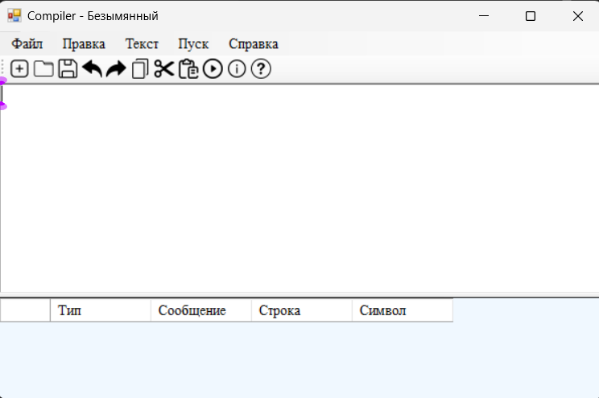
Программа состоит из:

1. Область редактирования (верхняя часть окна)
2. Область результатов анализа (нижняя часть окна)
3. Главное меню
4. Панель инструментов

## 6.2 Меню "Файл"

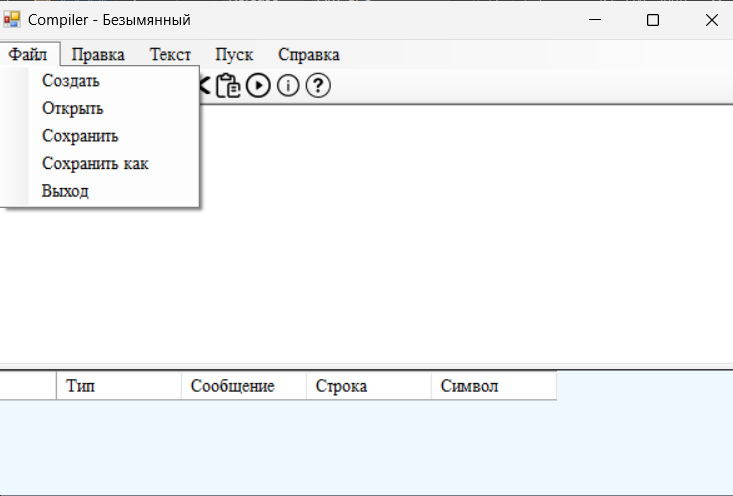

### Создать
Меню: **Файл → Создать**  
Кнопка: значок нового документа  

Создает новый файл.  
Если текст был изменен — появляется окно сохранения.
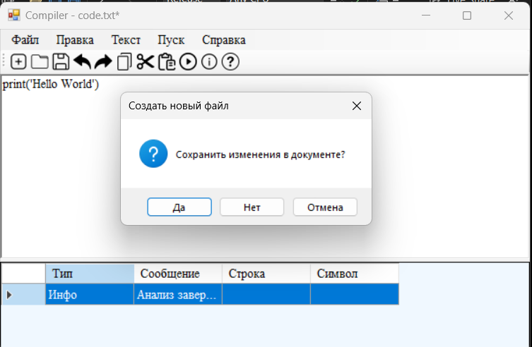

---

### Открыть
Меню: **Файл → Открыть**  
Кнопка: значок папки  

Открывает текстовый файл.

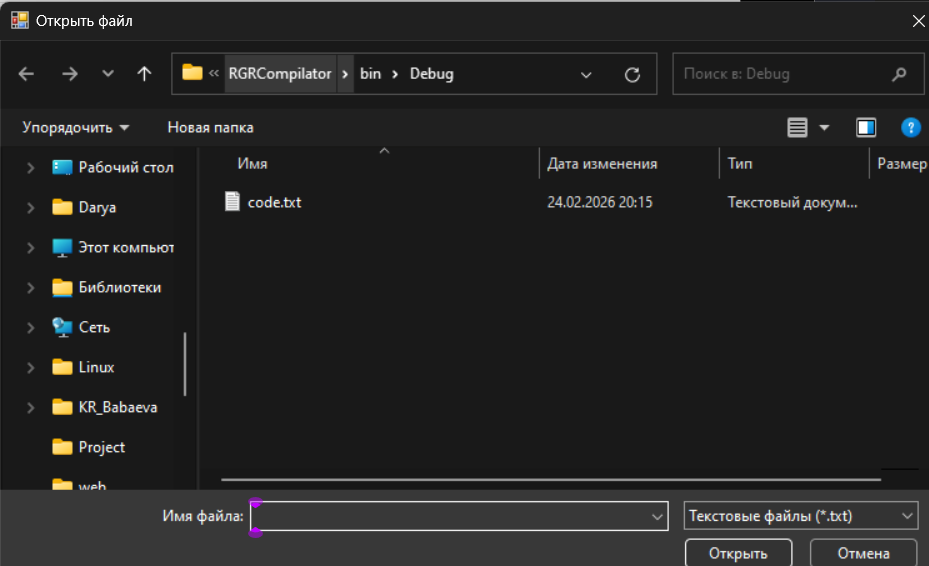

---

### Сохранить
Меню: **Файл → Сохранить**  
Кнопка: значок дискеты  

Сохраняет текущий файл.

---

### Сохранить как
Меню: **Файл → Сохранить как**  

Позволяет сохранить документ под новым именем.

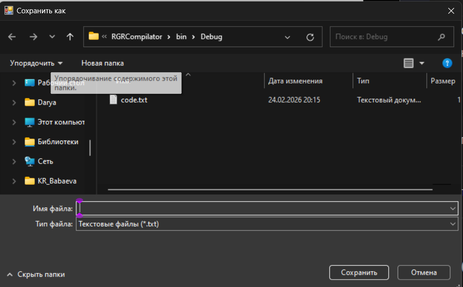

---
### Выход
Меню: **Файл → Выход**

Закрывает программу с проверкой сохранения изменений.

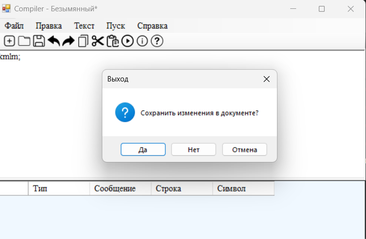

---

## 6.3 Меню "Правка"

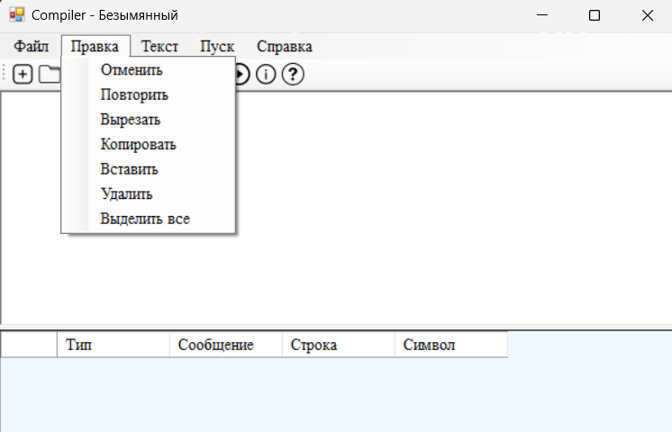

### Отменить
Меню: **Правка → Отменить**  
Кнопка: стрелка назад  

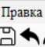

---

### Повторить
Меню: **Правка → Повторить**  
Кнопка: стрелка вперед  

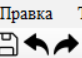

---

### Копировать / Вставить
Меню: **Правка**

Работа с буфером обмена.

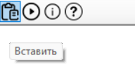

---

### Удалить
Удаляет выделенный текст.

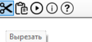

---

### Выделить всё
Выделяет весь текст.

---

## 6.4 Запуск анализа

Для запуска анализа:

- Нажать кнопку **Пуск**
или
- Выбрать соответствующий пункт меню

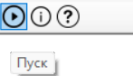

---

## 6.5 Отображение ошибок

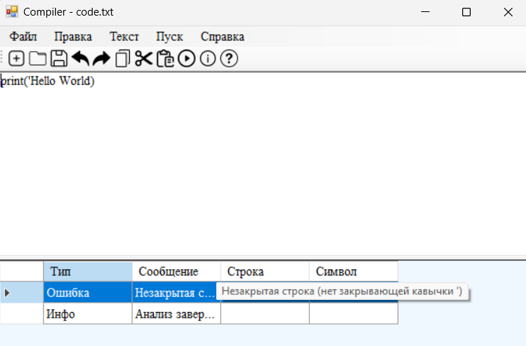

Программа обнаруживает:

- незакрытые строки;
- несоответствие скобок;
- недопустимые символы.

Ошибки отображаются в таблице результатов.

---

## 6.6 Переход к месту ошибки

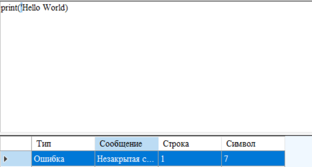

Для перехода к ошибке:

1. Выполнить двойной щелчок по строке ошибки.
2. Курсор переместится к месту ошибки.
3. Ошибочный фрагмент будет выделен.

---

# 7. Ограничения

- Анализатор реализует базовые проверки.
- Подсветка синтаксиса упрощенная.
- Поддерживаются тексты небольшого объема.
- Проект разработан в учебных целях.

---
# Лабораторная работа 2.
## Разработка лексического анализатора (сканера)
 
## Цель работы.
Изучить назначение и принципы работы лексического анализатора в структуре компилятора. Спроектировать алгоритм (диаграмму состояний) и выполнить программную реализацию сканера для выделения лексем из входного текста. Интегрировать разработанный модуль в ранее созданный графический интерфейс языкового процессора.

## Постановка задачи

Необходимо разработать лексический анализатор (сканер) для обработки объявлений и определений структуры на языке C и интегрировать его в созданное приложение. Анализатор должен принимать на вход исходный текст программы, выделять лексемы, относящиеся к объявлению структуры (ключевые слова, идентификаторы, типы данных, числа, операторы и разделители), и классифицировать их по типам. Символы, не соответствующие допустимым лексемам, должны определяться как ошибки с указанием их позиции в тексте. Сканер должен корректно обрабатывать многострочный текст. Результаты лексического анализа необходимо выводить в таблицу DataGridView с указанием условного кода лексемы, её типа, значения и местоположения в тексте, а при выборе строки с ошибкой курсор в редакторе должен автоматически переходить к позиции недопустимого символа.

## Текстовое описание варианта
- Номер варианта: 9
- Объявление и определение структуры на языке C
В данном варианте рассматривается объявление и определение структуры на языке C. Структура используется для объединения нескольких переменных различных типов данных в одну логическую единицу. Объявление структуры начинается с ключевого слова struct, после которого указывается имя структуры и список её полей, заключённых в фигурные скобки. Поля структуры представляют собой переменные различных типов данных (например, int, char, float, double), каждое из которых заканчивается точкой с запятой. После определения структуры также может следовать объявление переменной данной структуры.

Лексический анализатор должен распознавать лексемы, используемые при объявлении структуры: ключевые слова языка C, идентификаторы, числовые значения, операторы и разделители. Любые символы, не входящие в допустимый набор, должны определяться как ошибки с указанием их позиции в тексте программы.

## Диаграмма состояний
Диаграмма состояний описывает работу конечного автомата, реализующего лексический анализатор для обработки объявлений структур на языке C. Начальным является состояние Start, из которого выполняется анализ первого символа входной строки. Если символ является буквой, автомат переходит в состояние 1, где происходит распознавание ключевых слов (struct, int, float, char, double, long) или идентификаторов. В зависимости от распознанного слова присваивается соответствующий условный код лексемы. Если встречается пробел, автомат переходит в состояние 2, где формируется лексема-разделитель. При обнаружении символа ; осуществляется переход в состояние 3, которое соответствует концу оператора. Символ { переводит автомат в состояние 4, а символ } — в состояние 5, где формируются соответствующие лексемы-разделители. Если входной символ не соответствует ни одному допустимому переходу, автомат переходит в состояние Error, что означает обнаружение недопустимого символа.

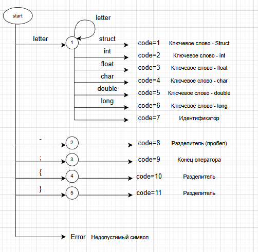

---

## Тестовые примеры

Пример 1. Вход: корректкая строка, введенная пользователем в область редактирования.

Выход: таблица, содержащая последовательность условных кодов и описаний лексем. struct Student { int id; char grade; float average; double scholarship; short course; };:

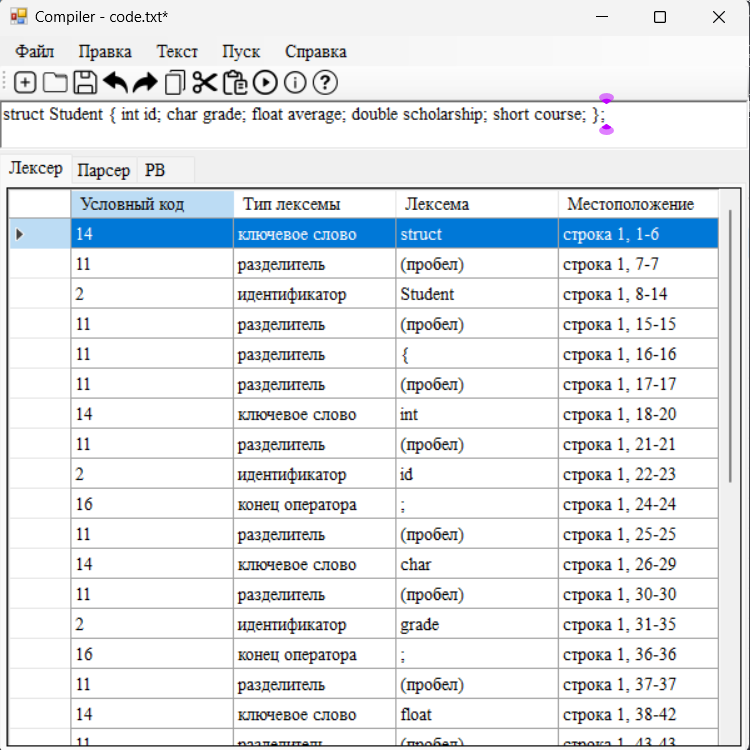

Пример 2. Вход: некорректная строка, введенная пользователем в область редактирования.

Выход: таблица, содержащая последовательность условных кодов и описаний лексем. struct Stud@ent { int id; };:

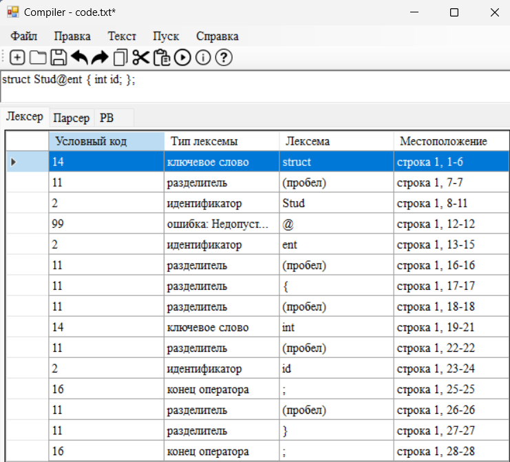

| Условный код | Тип лексемы   | Лексема	| Местоположение |
|--------------|---------------|------------|----------------|
|      14      |ключевое слово | struct		|строка 1, 1-6   |
|      11      |разделитель    | (пробел)	|строка 1, 7-7   |
|      2       |идентификатор  | Stud    	|строка 1, 8-11  |
|      99      |ошибка: Недопустимый символ   | @	|строка 1, 12-12 |
|      2       |идентификатор  | ent     	|строка 1, 13-15 |
|      11      |разделитель    | (пробел)	|строка 1, 16-16 |
|      11      |разделитель    | {      	|строка 1, 17-17 |
|      11      |разделитель    | (пробел)	|строка 1, 18-18 |
|      14      |ключевое слово | int		|строка 1, 19-21 |
|      11      |разделитель    | (пробел)	|строка 1, 22-22 |
|      2       |идентификатор  | id			|строка 1, 23-24 |
|      16      |конец оператора| ;			|строка 1, 25-25 |
|      11      |разделитель    | (пробел)	|строка 1, 26-26 |
|      11      |разделитель    | }          |строка 1, 27-27 |
|      16      |конец оператора| ;			|строка 1, 28-28 |
--------------------------------------------------------------

Пример 3. Вход: многострочный пример, введенный пользователем в область редактирования.

Выход: таблица, содержащая последовательность условных кодов и описаний лексем. struct 
struct Student
{
    int id;
    char grade;
    float average;
};:

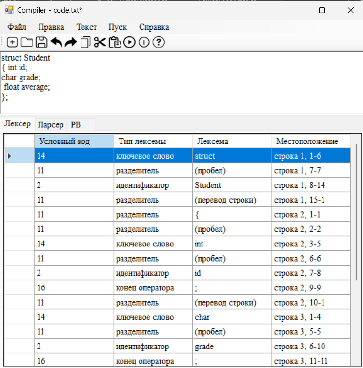

| Условный код | Тип лексемы   | Лексема	| Местоположение |
|--------------|---------------|------------|----------------|
|      14      |ключевое слово | struct		|строка 1, 1-6   |
|      11      |разделитель    | (пробел)	|строка 1, 7-7   |
|      2       |идентификатор  | Student   	|строка 1, 8-14  |
|      11      |разделитель    | (перевод строки)	|строка 1, 15-1 |
|      11      |разделитель    | {      	|строка 2, 1-1   |
|      11      |разделитель    | (перевод строки)	|строка 2, 2-1 |
|      14      |ключевое слово | int		|строка 3, 5-7   |
|      11      |разделитель    | (пробел)	|строка 3, 8-8   |
|      2       |идентификатор  | id			|строка 3, 9-10  |
|      16      |конец оператора| ;			|строка 3, 11-11 |
|      11      |разделитель    | (перевод строки)	|строка 3, 12-1 |
|      14      |ключевое слово | char		|строка 4, 5-8   |
|      11      |разделитель    | (пробел)	|строка 4, 9-9   |
|      2       |идентификатор  | grade		|строка 4, 10-14 |
|      16      |конец оператора| ;			|строка 4, 15-15 |
|      11      |разделитель    | (перевод строки)	|строка 4, 16-1 |
|      2       |ключевое слово | float  	|строка 5, 5-9   |
|      11      |разделитель    | (пробел)	|строка 5, 10-10 |
|      2       |идентификатор  | average    |строка 5, 11-17 |
|      16      |конец оператора| ;			|строка 5, 18-18 |
|      11      |разделитель    | (перевод строки)	|строка 5, 19-1 |
|      11      |разделитель    | }          |строка 6, 1-1   |
|      16      |конец оператора| ;			|строка 6, 2-2   |
--------------------------------------------------------------

---
## Вывод
В ходе выполнения работы был разработан лексический анализатор для обработки объявлений и определений структуры на языке C. Реализован конечный автомат, позволяющий выделять и классифицировать лексемы исходного текста программы, такие как ключевые слова, идентификаторы, числа, операторы и разделители. Анализатор интегрирован в графический интерфейс приложения и выводит результаты анализа в виде таблицы с указанием типа лексемы, её условного кода и местоположения в тексте. Также реализовано обнаружение недопустимых символов и переход курсора к позиции ошибки. Проведённое тестирование показало корректную работу программы при обработке как корректных, так и ошибочных входных данных.

## Лабораторная работа 3. 
### Разработка синтаксического анализатора (парсера)

## Цель работы.
Изучить назначение и принципы работы синтаксического анализатора в структуре компилятора. Спроектировать грамматику, построить соответствующую схему метода анализа грамматики и выполнить программную реализацию парсера с нейтрализацией синтаксических ошибок методом Айронса. Интегрировать разработанный модуль в ранее созданный графический интерфейс языкового процессора.

## Постановка задачи
Разработать синтаксический анализатор (парсер) для конструкции объявления и определения структуры на языке C, интегрировать его в приложение из лабораторной работы №1 и обеспечить наглядный вывод результатов анализа.

## Текстовое описание варианта
- Номер варианта: 9
- Объявление и определение структуры на языке C
В данном варианте рассматривается объявление и определение структуры на языке C. Структура используется для объединения нескольких переменных различных типов данных в одну логическую единицу. Объявление структуры начинается с ключевого слова struct, после которого указывается имя структуры и список её полей, заключённых в фигурные скобки. Поля структуры представляют собой переменные различных типов данных (например, int, char, float, double), каждое из которых заканчивается точкой с запятой. После определения структуры также может следовать объявление переменной данной структуры.
Допустимые лексемы: ключевые слова struct, int, char, float, double, short, long, signed, unsigned, void, идентификаторы (имена структур и полей), разделители {, }, ;, ,, а также пробельные символы.
Пример верной строки:
struct str1 {
    int i;
    char c;
    float f;
};

## Разработка грамматики

Для синтаксической конструкции объявления и определения структуры на языке C разработана контекстно-свободная грамматика. Грамматика описывает структуру вида struct <имя> { <список полей> };, где каждое поле задаётся типом и именем с последующей точкой с запятой.

Правила грамматики имеют следующий вид:

Разработанная грамматика используется для построения синтаксического анализатора методом рекурсивного спуска, при котором каждому нетерминальному символу соответствует отдельная процедура разбора.

## Классификация грамматики (по Хомскому)

Разработанная грамматика относится к классу контекстно-свободных грамматик (тип 2 по классификации Хомского), так как каждое правило имеет вид, в котором слева стоит один нетерминальный символ, а справа — последовательность терминальных и нетерминальных символов.
Грамматика не является регулярной (тип 3), поскольку описывает вложенные и иерархические конструкции (структуру с блоком полей в фигурных скобках), что требует более мощного формализма.
Таким образом, для её обработки используется синтаксический анализ методом рекурсивного спуска, который подходит для контекстно-свободных грамматик.

## Метод анализа (алгоритм синтаксического анализа - рекурсивный спуск)

Для синтаксического анализа используется метод рекурсивного спуска. Данный метод основан на разборе входной последовательности лексем с помощью набора взаимосвязанных процедур, каждая из которых соответствует одному нетерминальному символу грамматики.
Анализ начинается с начального символа <StructDef> и выполняется последовательно, проверяя соответствие входной строки правилам грамматики. Для каждого нетерминала реализован отдельный метод (например, ParseStructDef, ParseFieldList, ParseField), который проверяет ожидаемые лексемы и вызывает другие методы при необходимости.
В случае несоответствия ожидаемой и фактической лексемы фиксируется синтаксическая ошибка, после чего анализ продолжается. Такой подход позволяет обнаруживать несколько ошибок за один проход.
Метод рекурсивного спуска выбран из-за его простоты реализации и наглядного соответствия разработанной грамматике.

## Диагностика и нейтрализация синтаксических ошибок

В процессе синтаксического анализа выполняется диагностика ошибок, возникающих при несоответствии входной последовательности лексем правилам грамматики. При обнаружении ошибки фиксируется неверный фрагмент, его местоположение (номер строки и позиция) и описание.
Для обеспечения продолжения анализа используется метод нейтрализации ошибок Айронса. Суть метода заключается в пропуске части входной последовательности до ближайшего синхронизирующего символа (например, ;, {, }), после чего анализ продолжается с корректного состояния.
Данный подход позволяет не завершать работу после первой ошибки, а выявлять несколько синтаксических ошибок за один проход, что повышает информативность результатов анализа.

## Тестовые примеры

Для проверки работы синтаксического анализатора были использованы различные входные строки, включая корректные и содержащие ошибки. Результаты анализа отображаются в интерфейсе программы в виде таблицы ошибок.

Пример 1 — корректная строка
Входная строка: struct str1 { int i; char c; float f; };

Пример 2 — одна ошибка
Входная строка: struct str1 { int ; char c; };
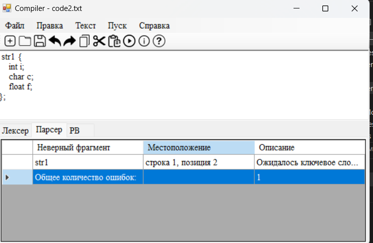

Пример 3 — несколько ошибок
Входная строка: struct { int ; char c float f; }
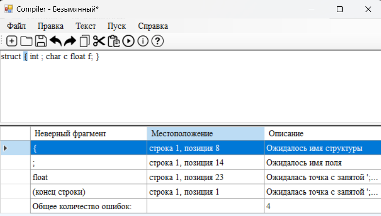

Пример 5 — отсутствие ключевого слова
Входная строка: str1 { int a; };
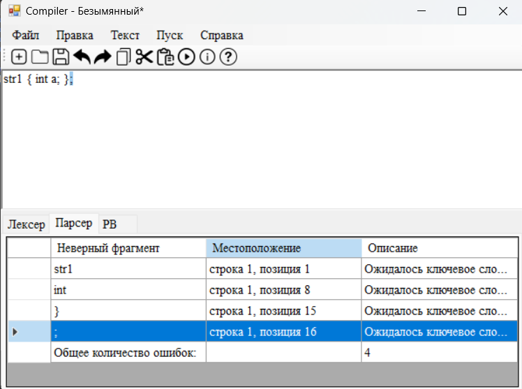

## Вывод

В ходе лабораторной работы был разработан синтаксический анализатор для конструкции объявления и определения структуры на языке C. Построена формальная грамматика и реализован алгоритм синтаксического анализа методом рекурсивного спуска. В программе обеспечено выявление и обработка синтаксических ошибок с использованием метода Айронса, что позволяет продолжать анализ после обнаружения ошибок. Реализован удобный вывод результатов в виде таблицы с указанием местоположения ошибок и возможностью перехода

## Лабораторная работа 4.
### Реализация алгоритма поиска подстрок с помощью регулярных выражений.

## Цель работы
Изучить теоретические основы регулярных выражений и их применение для поиска и извлечения подстрок из текста. Освоить практические навыки использования библиотечных средств работы с регулярными выражениями, а также интеграцию алгоритмов поиска в графический интерфейс приложения.

## Постановка задачи
Разработать модуль поиска подстрок с использованием регулярных выражений, интегрировать его в существующее приложение (текстовый редактор) и обеспечить наглядный вывод результатов.
Вариант задания:
Блок 1: 12.Построить РВ для того, чтобы сопоставить все числа, которые не заканчиваются на 5.
Блок 2: 27. Построить РВ, описывающее все виды комментариев (язык Python).
Блок 3: 26. Построить РВ для поиска любого химического элемента из таблицы Менделеева (118 элементов).

## Решение задач

1. Построить РВ для того, чтобы сопоставить все числа, которые не заканчиваются на 5.
   
3. Построить РВ, описывающее все виды комментариев (язык Python).
4. Построить РВ для поиска любого химического элемента из таблицы Менделеева (118 элементов).

