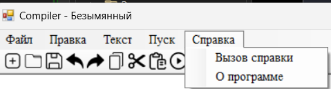

# Лабораторная работа 1. 
## Разработка пользовательского интерфейса (GUI) для языкового процессора

## Цель работы.
Создание кроссплатформенного графического интерфейса (GUI) для языкового процессора в виде специализированного текстового редактора.

## Сведения об авторе

ФИО: Бабаева Дарья  
Группа: АП-326  
Дисциплина: Теория формальных языков и компиляторов
Год выполнения: 2026 

## Описание проекта

Разработанное приложение представляет собой текстовый редактор с функцией анализа текста (упрощённый компилятор).

Программа позволяет:

- создавать и открывать текстовые файлы;
- сохранять документы;
- редактировать текст;
- выполнять синтаксический анализ;
- выявлять ошибки;
- отображать результаты анализа;
- переходить к месту ошибки по двойному щелчку.

Реализована подсветка синтаксиса (ключевые слова, строки, числа, комментарии).

## Используемые технологии
- Язык программирования: **C#**
- Платформа: **.NET**
- GUI-фреймворк: **Windows Forms (WinForms)**
- Среда разработки: **Microsoft Visual Studio**
- Система контроля версий: **Git**
- Хостинг репозитория: **GitHub**

## 5. Инструкция по сборке и запуску

Программа может работать как самостоятельное приложение и не требует установки Visual Studio.

---

## Запуск программы

1. Перейдите в папку с программой.
2. Найдите файл:

RGRCompilator.exe

3. Дважды щёлкните по файлу мышью.

Программа откроется как обычное приложение Windows.

---

## Если программа скачана из GitHub

1. Скачайте архив проекта (кнопка **Code → Download ZIP**).
2. Распакуйте архив в любую папку.
3. Найдите файл: RGRCompilator.exe
4. Дважды щёлкните по файлу мышью.

Программа откроется как обычное приложение Windows.

## Возможные проблемы

Если Windows показывает предупреждение безопасности:

1. Нажмите **Подробнее**.
2. Затем нажмите **Выполнить в любом случае**.

Это стандартное предупреждение для приложений без цифровой подписи.

---

## Системные требования

- Операционная система: Windows 10 / Windows 11
- Архитектура: 64-bit
- Дополнительные компоненты: не требуются
# 6. Руководство пользователя

---

## 6.1 Общий вид интерфейса

Программа состоит из:

1. Область редактирования (верхняя часть окна)
2. Область результатов анализа (нижняя часть окна)
3. Главное меню
4. Панель инструментов

## 6.2 Меню "Файл"

### Создать
Меню: **Файл → Создать**  
Кнопка: значок нового документа  

Создает новый файл.  
Если текст был изменен — появляется окно сохранения.

---

### Открыть
Меню: **Файл → Открыть**  
Кнопка: значок папки  

Открывает текстовый файл.

---

### Сохранить
Меню: **Файл → Сохранить**  
Кнопка: значок дискеты  

Сохраняет текущий файл.

---

### Сохранить как
Меню: **Файл → Сохранить как**  

Позволяет сохранить документ под новым именем.

---
### Выход
Меню: **Файл → Выход**

Закрывает программу с проверкой сохранения изменений.

---

## 6.3 Меню "Правка"

### Отменить
Меню: **Правка → Отменить**  
Кнопка: стрелка назад  

---

### Повторить
Меню: **Правка → Повторить**  
Кнопка: стрелка вперед  

---

### Вырезать / Копировать / Вставить
Меню: **Правка**

Работа с буфером обмена.

---

### Удалить
Удаляет выделенный текст.

---

### Выделить всё
Выделяет весь текст.

---

## 6.4 Запуск анализа

Для запуска анализа:

- Нажать кнопку **Пуск**
или
- Выбрать соответствующий пункт меню

---

## 6.5 Отображение ошибок

Программа обнаруживает:

- незакрытые строки;
- несоответствие скобок;
- недопустимые символы.

Ошибки отображаются в таблице результатов.

---

## 6.6 Переход к месту ошибки

Для перехода к ошибке:

1. Выполнить двойной щелчок по строке ошибки.
2. Курсор переместится к месту ошибки.
3. Ошибочный фрагмент будет выделен.

---

# 7. Ограничения

- Анализатор реализует базовые проверки.
- Подсветка синтаксиса упрощенная.
- Поддерживаются тексты небольшого объема.
- Проект разработан в учебных целях.

---

# Версия

Версия 1.0