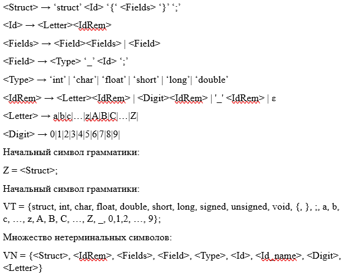
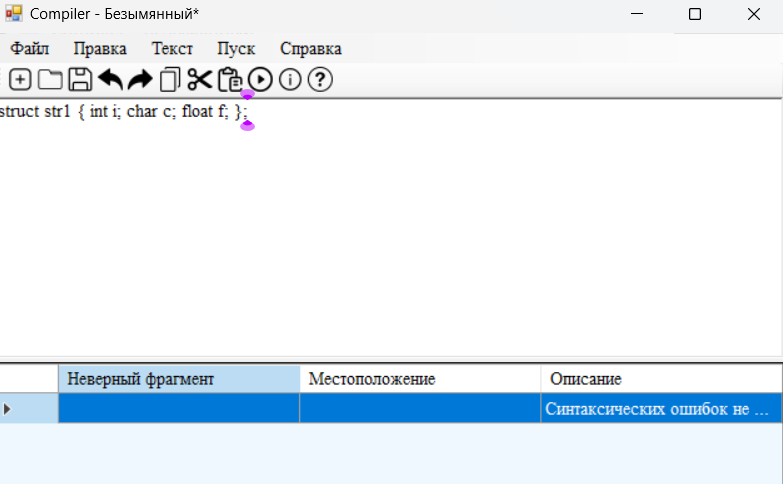

# Лабораторная работа 3. 
## Разработка синтаксического анализатора (парсера)

## Цель работы.
Изучить назначение и принципы работы синтаксического анализатора в структуре компилятора. Спроектировать грамматику, построить соответствующую схему метода анализа грамматики и выполнить программную реализацию парсера с нейтрализацией синтаксических ошибок методом Айронса. Интегрировать разработанный модуль в ранее созданный графический интерфейс языкового процессора.

## Сведения об авторе

ФИО: Бабаева Дарья  
Группа: АП-326  
Дисциплина: Теория формальных языков и компиляторов
Год выполнения: 2026 

## Постановка задачи
Разработать синтаксический анализатор (парсер) для конструкции объявления и определения структуры на языке C, интегрировать его в приложение из лабораторной работы №1 и обеспечить наглядный вывод результатов анализа.

## Текстовое описание варианта
- Номер варианта: 9
- Объявление и определение структуры на языке C
В данном варианте рассматривается объявление и определение структуры на языке C. Структура используется для объединения нескольких переменных различных типов данных в одну логическую единицу. Объявление структуры начинается с ключевого слова struct, после которого указывается имя структуры и список её полей, заключённых в фигурные скобки. Поля структуры представляют собой переменные различных типов данных (например, int, char, float, double), каждое из которых заканчивается точкой с запятой. После определения структуры также может следовать объявление переменной данной структуры.
Допустимые лексемы: ключевые слова struct, int, char, float, double, short, long, signed, unsigned, void, идентификаторы (имена структур и полей), разделители {, }, ;, ,, а также пробельные символы.

## Разработка грамматики

Для синтаксической конструкции объявления и определения структуры на языке C разработана контекстно-свободная грамматика. Грамматика описывает структуру вида struct <имя> { <список полей> };, где каждое поле задаётся типом и именем с последующей точкой с запятой.

Правила грамматики имеют следующий вид:

Разработанная грамматика используется для построения синтаксического анализатора методом рекурсивного спуска, при котором каждому нетерминальному символу соответствует отдельная процедура разбора.

## Классификация грамматики (по Хомскому)

Разработанная грамматика относится к классу контекстно-свободных грамматик (тип 2 по классификации Хомского), так как каждое правило имеет вид, в котором слева стоит один нетерминальный символ, а справа — последовательность терминальных и нетерминальных символов.
Грамматика не является регулярной (тип 3), поскольку описывает вложенные и иерархические конструкции (структуру с блоком полей в фигурных скобках), что требует более мощного формализма.
Таким образом, для её обработки используется синтаксический анализ методом рекурсивного спуска, который подходит для контекстно-свободных грамматик.

## Метод анализа (алгоритм синтаксического анализа - рекурсивный спуск)

Для синтаксического анализа используется метод рекурсивного спуска. Данный метод основан на разборе входной последовательности лексем с помощью набора взаимосвязанных процедур, каждая из которых соответствует одному нетерминальному символу грамматики.
Анализ начинается с начального символа <StructDef> и выполняется последовательно, проверяя соответствие входной строки правилам грамматики. Для каждого нетерминала реализован отдельный метод (например, ParseStructDef, ParseFieldList, ParseField), который проверяет ожидаемые лексемы и вызывает другие методы при необходимости.
В случае несоответствия ожидаемой и фактической лексемы фиксируется синтаксическая ошибка, после чего анализ продолжается. Такой подход позволяет обнаруживать несколько ошибок за один проход.
Метод рекурсивного спуска выбран из-за его простоты реализации и наглядного соответствия разработанной грамматике.

## Диагностика и нейтрализация синтаксических ошибок

В процессе синтаксического анализа выполняется диагностика ошибок, возникающих при несоответствии входной последовательности лексем правилам грамматики. При обнаружении ошибки фиксируется неверный фрагмент, его местоположение (номер строки и позиция) и описание.
Для обеспечения продолжения анализа используется метод нейтрализации ошибок Айронса. Суть метода заключается в пропуске части входной последовательности до ближайшего синхронизирующего символа (например, ;, {, }), после чего анализ продолжается с корректного состояния.
Данный подход позволяет не завершать работу после первой ошибки, а выявлять несколько синтаксических ошибок за один проход, что повышает информативность результатов анализа.

## Тестовые примеры

Для проверки работы синтаксического анализатора были использованы различные входные строки, включая корректные и содержащие ошибки. Результаты анализа отображаются в интерфейсе программы в виде таблицы ошибок.

Пример 1 — корректная строка
Входная строка: struct str1 { int i; char c; float f; };

Пример 2 — одна ошибка
Входная строка: struct str1 { int ; char c; };

Пример 3 — несколько ошибок
Входная строка: struct { int ; char c float f; }

Пример 5 — отсутствие ключевого слова
Входная строка: str1 { int a; };

## Вывод

В ходе лабораторной работы был разработан синтаксический анализатор для конструкции объявления и определения структуры на языке C. Построена формальная грамматика и реализован алгоритм синтаксического анализа методом рекурсивного спуска. В программе обеспечено выявление и обработка синтаксических ошибок с использованием метода Айронса, что позволяет продолжать анализ после обнаружения ошибок. Реализован удобный вывод результатов в виде таблицы с указанием местоположения ошибок и возможностью перехода к ним в тексте. Разработанный анализатор корректно обрабатывает как правильные, так и ошибочные входные данные.
